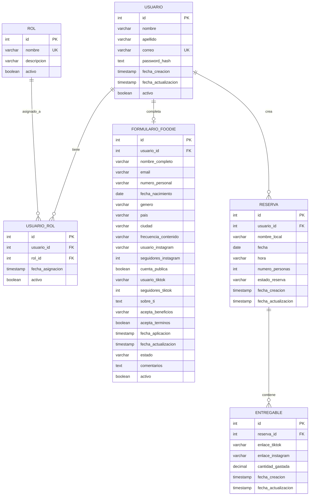

# 📋 Documento de Especificación Funcional - FoodiesBNB

## 🍽️ 1. Descripción del Proyecto

**FoodiesBNB** es una plataforma web integral que revoluciona la industria gastronómica al conectar estratégicamente **microinfluencers gastronómicos (foodies)** con **restaurantes**, creando una sinergia mutuamente beneficiosa. El sistema está diseñado bajo una arquitectura de microservicios robusta que gestiona todo el ciclo de vida de las colaboraciones, desde el registro inicial hasta la generación de análisis predictivos avanzados.

### 🎯 Visión General del Sistema

La plataforma opera como un ecosistema digital completo que facilita:

- **🤝 Conexión Estratégica**: Vinculación automatizada entre microinfluencers y restaurantes según criterios de alcance, nicho y ubicación geográfica.

- **📅 Gestión de Reservas**: Sistema inteligente de reservas con estados dinámicos que permite a los foodies agendar visitas a restaurantes, gestionar su disponibilidad y coordinar la creación de contenido promocional.

- **📱 Generación de Contenido**: Los microinfluencers crean y publican contenido gastronómico auténtico en redes sociales (TikTok e Instagram) como parte de sus colaboraciones con los restaurantes.

- **📊 Recopilación de Datos Transaccionales**: Captura sistemática de información crítica de cada visita: fecha, hora, número de personas, monto gastado, contenido generado, engagement obtenido, y más.

- **🏪 Dashboards Especializados**: Interfaces diferenciadas por rol (foodie, restaurante, administrador) que permiten visualizar información relevante y tomar decisiones informadas.

- **🔐 Sistema de Autenticación Multinivel**: Gestión segura de usuarios con roles jerárquicos (usuario, foodie, restaurante, admin) y permisos granulares mediante JWT.

### 🏗️ Arquitectura Tecnológica

El sistema está construido con tecnologías de vanguardia:

**Backend (FoodiesBackWEB)**:
- **.NET 9** con arquitectura de microservicios independientes
- **PostgreSQL** como sistema de gestión de base de datos
- **API Gateway (YARP)** para enrutamiento centralizado
- **JWT Bearer Authentication** para seguridad stateless
- **Entity Framework Core** con patrón Repository y CQRS

**Frontend (FoodiesFrontWEB)**:
- **Angular 17+** con componentes standalone
- **PrimeNG** para componentes UI empresariales
- **RxJS** para programación reactiva
- **Server-Side Rendering (SSR)** para optimización SEO
- **TypeScript 5+** con tipado estricto

**Microservicios Principales**:

1. **UsersApi (Puerto 5001)**: Gestión de usuarios, autenticación JWT, sistema de roles y permisos.
2. **ReservasApi (Puerto 5004)**: CRUD de reservas, gestión de entregables, lógica de estados automáticos, comunicación inter-servicios.
3. **FormularioFoodieApi (Puerto 5002)**: Aplicaciones de foodies, validación de perfiles, gestión de aprobaciones.
4. **GatewayApi (Puerto 5000)**: Punto de entrada único, enrutamiento, middleware de autenticación.

### 📈 Flujo de Negocio Principal

1. **Registro y Onboarding**: Los usuarios se registran como foodies completando un formulario detallado con sus métricas de redes sociales (seguidores, engagement, frecuencia de publicación).

2. **Aprobación**: El sistema valida que los foodies cumplan con requisitos mínimos (seguidores, cuenta pública, actividad reciente).

3. **Exploración de Restaurantes**: Los foodies autorizados navegan por restaurantes asociados, filtran por ubicación, tipo de cocina y beneficios ofrecidos.

4. **Creación de Reservas**: El foodie genera una reserva especificando fecha, hora, número de acompañantes y restaurante seleccionado.

5. **Visita y Experiencia**: El foodie visita el restaurante en la fecha acordada, disfruta de la experiencia gastronómica y documenta todo el proceso.

6. **Generación de Contenido**: Dentro de las 48 horas posteriores a la visita, el foodie publica contenido en sus redes sociales (TikTok/Instagram) y registra los enlaces en la plataforma junto con el monto gastado.

7. **Validación Automática**: El sistema actualiza automáticamente el estado de la reserva:
   - **"Por Ir"**: Estado inicial cuando se crea la reserva
   - **"Visita Completada"**: Cuando se suben los entregables dentro del plazo
   - **"Falta Grave"**: Si pasan 48 horas post-visita sin entregables

8. **Recopilación de Métricas**: La plataforma extrae y almacena datos de cada interacción: fecha de visita, cantidad gastada, alcance del contenido, interacciones recibidas.

---

## 🎯 2. Explicación Específica del Core Propuesto

El **Core de FoodiesBNB** se centra en proporcionar **valor agregado mediante análisis de datos avanzado y predicciones estadísticas** para los restaurantes. A diferencia del flujo operativo básico de conectar foodies con restaurantes, el Core transforma los datos transaccionales en **inteligencia de negocio accionable**.

### 🧠 Concepto Central del Core

El Core implementa un **sistema de analytics predictivo** que procesa toda la información recopilada de las reservas, visitas, entregables y transacciones para generar insights estratégicos que ayuden a los restaurantes a:

- **Optimizar sus operaciones**
- **Maximizar sus ingresos**
- **Entender el comportamiento de sus clientes**
- **Predecir tendencias futuras**
- **Tomar decisiones basadas en datos**

### 📊 Fuentes de Datos del Core

El Core extrae información de múltiples tablas de la base de datos:

1. **Tabla Reservas**:
   - `UsuarioId` (foodie que visitó)
   - `NombreLocal` (restaurante visitado)
   - `Fecha` (cuándo ocurrió la visita)
   - `Hora` (hora específica de la visita)
   - `NumeroPersonas` (tamaño del grupo)
   - `EstadoReserva` (completitud de la visita)

2. **Tabla Entregables**:
   - `ReservaId` (vinculación con la reserva)
   - `EnlaceTikTok` (contenido en TikTok)
   - `EnlaceInstagram` (contenido en Instagram)
   - `CantidadGastada` (gasto total en el restaurante)

3. **Tabla Usuarios**:
   - `Id`, `Nombre`, `Apellido` (identificación del foodie)
   - `Correo` (contacto)
   - `Roles` (tipo de usuario)

4. **Tabla FormularioFoodie**:
   - `SeguidoresInstagram`, `SeguidoresTikTok` (alcance potencial)
   - `FrecuenciaContenido` (actividad del foodie)
   - `Ciudad`, `Pais` (segmentación geográfica)

### 🔬 Métricas y Cálculos del Core

El Core implementa múltiples algoritmos de análisis:

#### **A. Análisis de Visitación**

```
Total_Visitas_Mes = COUNT(Reservas WHERE EstadoReserva = "Visita Completada" AND Fecha BETWEEN fecha_inicio AND fecha_fin)

Tasa_Completitud = (Visitas_Completadas / Total_Reservas) × 100

Promedio_Personas_Por_Visita = AVG(NumeroPersonas WHERE EstadoReserva = "Visita Completada")

Tasa_Falta_Grave = (COUNT(EstadoReserva = "Falta Grave") / Total_Reservas) × 100
```

#### **B. Análisis de Ingresos**

```
Ingresos_Totales_Periodo = SUM(CantidadGastada WHERE Fecha BETWEEN fecha_inicio AND fecha_fin)

Ticket_Promedio = Ingresos_Totales / Total_Visitas_Completadas

Ingresos_Por_Persona = SUM(CantidadGastada) / SUM(NumeroPersonas)

Mejor_Dia_Ingresos = MAX(SUM(CantidadGastada) GROUP BY DAY(Fecha))

Mejor_Mes_Ingresos = MAX(SUM(CantidadGastada) GROUP BY MONTH(Fecha))
```

#### **C. Análisis Temporal de Demanda**

```
Distribución_Por_Día_Semana = COUNT(Reservas) GROUP BY DAYOFWEEK(Fecha)

Distribución_Por_Hora = COUNT(Reservas) GROUP BY Hora

Picos_Demanda = IDENTIFY(Hora WHERE COUNT > AVG + 1.5×STDDEV)

Horas_Valle = IDENTIFY(Hora WHERE COUNT < AVG - 1.0×STDDEV)
```

#### **D. Análisis de Productos/Menú**

Aunque actualmente el sistema no captura items específicos del menú, se puede inferir mediante:

```
Gasto_Promedio_Por_Categoria_Tiempo = AVG(CantidadGastada) GROUP BY (Hora, DiaSemana)

// Identificar patrones:
// Si Hora = "12:00-14:00" → Categoría = "Almuerzo"
// Si Hora = "19:00-22:00" → Categoría = "Cena"
// Si DiaSemana = "Sábado/Domingo" AND Hora = "10:00-12:00" → Categoría = "Brunch"
```

#### **E. Análisis de Alcance y ROI del Marketing**

```
Alcance_Total_Contenido = SUM(SeguidoresInstagram + SeguidoresTikTok) WHERE Reserva.EstadoReserva = "Visita Completada"

Costo_Por_Alcance = (Descuentos_Otorgados + Costos_Operativos) / Alcance_Total

ROI_Marketing_Influencers = ((Ingresos_Generados - Costo_Total) / Costo_Total) × 100

Engagement_Rate = (Interacciones_Totales / Alcance_Total) × 100  
// Nota: Requiere integración futura con APIs de redes sociales
```

#### **F. Modelos Predictivos con Regresión Lineal**

El Core implementará regresión lineal para predicciones:

**F.1. Predicción de Ingresos Futuros**

```
Modelo: Ingresos(t) = β₀ + β₁×t + ε

Donde:
- t = tiempo (días, semanas o meses)
- β₀ = intercepto (ingresos base)
- β₁ = tendencia (crecimiento diario/mensual)
- ε = error aleatorio

Implementación:
1. Recopilar datos históricos: (t₁, Ingresos₁), (t₂, Ingresos₂), ..., (tₙ, Ingresosₙ)
2. Calcular coeficientes mediante mínimos cuadrados:
   β₁ = (n×Σ(t×Ingresos) - Σt×ΣIngresos) / (n×Σt² - (Σt)²)
   β₀ = (ΣIngresos - β₁×Σt) / n
3. Predecir: Ingresos_Futuro(t_futuro) = β₀ + β₁×t_futuro

Ejemplo de uso:
"Si continúas con esta tendencia, en 3 meses tus ingresos proyectados serán de $X,XXX"
```

**F.2. Predicción de Demanda por Día**

```
Modelo: Visitas(dia) = β₀ + β₁×(dia_semana) + β₂×(temporada) + β₃×(promociones_activas)

Variables independientes:
- dia_semana: 1=Lunes, 2=Martes, ..., 7=Domingo
- temporada: 1=Temporada Alta, 0=Temporada Baja
- promociones_activas: Count de promociones vigentes

Predicción:
"Los viernes históricamente tienes un 35% más de visitas que el promedio semanal"
```

**F.3. Predicción de Ticket Promedio**

```
Modelo: Ticket(t) = β₀ + β₁×(num_personas) + β₂×(hora_visita) + β₃×(dia_semana)

Esto permite:
- Estimar ingresos por reserva antes de que ocurra
- Identificar grupos de mayor valor
- Optimizar asignación de mesas
```

#### **G. Análisis de Estacionalidad**

```
Índice_Estacionalidad(mes) = (Promedio_Mes / Promedio_General) × 100

// Si Índice > 100 → Mes con demanda superior al promedio
// Si Índice < 100 → Mes con demanda inferior al promedio

Desviación_Estándar_Ingresos = SQRT(Σ(Ingresos_Mes - Promedio)² / n)

Coeficiente_Variación = (Desviación_Estándar / Promedio) × 100
// Mide qué tan predecibles son los ingresos
```

### 📈 Dashboards y Visualizaciones del Core

El Core presentará la información mediante:

1. **Gráficos de Línea**: Evolución temporal de ingresos, visitas y ticket promedio
2. **Gráficos de Barras**: Comparativas mensuales, distribución por día de semana
3. **Mapas de Calor**: Horas pico de demanda (días vs horas)
4. **Gráficos de Tendencia**: Proyecciones futuras con intervalos de confianza
5. **KPIs Destacados**: Métricas clave en tarjetas visuales
6. **Tablas Detalladas**: Rankings de productos, foodies más efectivos

### 🎯 Valor Agregado del Core

El Core transforma a FoodiesBNB de una simple plataforma de reservas en un **socio estratégico para el crecimiento del restaurante**, proporcionando:

✅ **Inteligencia de Negocio**: "Tus mayores ingresos ocurren los viernes entre 20:00-22:00"

✅ **Optimización Operativa**: "Reduce personal en martes por menor demanda"

✅ **Predicciones Accionables**: "En base a tu tendencia, alcanzarás $50,000 en ventas este trimestre"

✅ **Identificación de Oportunidades**: "Los grupos de 4+ personas gastan 40% más que parejas"

✅ **Validación de Estrategias**: "Las promociones de lunes aumentaron visitas en 25%"

✅ **Benchmarking**: "Tu ticket promedio es $45, comparado con $38 del sector"

---

## 🎯 3. Alcance del Core

El alcance del Core define específicamente qué funcionalidades de análisis y predicción serán implementadas en la plataforma FoodiesBNB para proporcionar valor agregado a los restaurantes.

### ✅ 3.1. Funcionalidades Incluidas en el Core

#### **A. Módulo de Estadísticas Generales**

**Descripción**: Dashboard con métricas clave del restaurante en tiempo real.

**Funcionalidades**:
- ✅ Total de visitas completadas en periodo seleccionado
- ✅ Total de reservas activas ("Por Ir")
- ✅ Conteo de faltas graves registradas
- ✅ Tasa de completitud de reservas (%)
- ✅ Número total de foodies únicos que han visitado
- ✅ Promedio de personas por visita
- ✅ Comparativa periodo actual vs periodo anterior

**Filtros disponibles**:
- Por rango de fechas (última semana, último mes, últimos 3 meses, últimos 6 meses, último año, personalizado)
- Por estado de reserva
- Por foodie específico

---

#### **B. Módulo de Análisis de Ingresos**

**Descripción**: Análisis detallado de los ingresos generados a través de la plataforma.

**Métricas calculadas**:
- ✅ **Ingresos totales del periodo**: `SUM(Entregables.CantidadGastada)`
- ✅ **Ticket promedio**: `Ingresos_Totales / Cantidad_Visitas`
- ✅ **Gasto promedio por persona**: `Ingresos_Totales / SUM(NumeroPersonas)`
- ✅ **Día con mayores ingresos**: `MAX(SUM(CantidadGastada) GROUP BY Fecha)`
- ✅ **Hora con mayores ingresos**: `MAX(SUM(CantidadGastada) GROUP BY Hora)`
- ✅ **Evolución mensual de ingresos**: Gráfico de línea
- ✅ **Distribución de ingresos por día de la semana**: Gráfico de barras
- ✅ **Top 10 visitas con mayor gasto**: Tabla ordenada descendente

**Visualizaciones**:
- 📊 Gráfico de línea con tendencia de ingresos mensuales
- 📊 Gráfico de barras comparativo por día de semana
- 📊 Tabla detallada con ranking de visitas más rentables

---

#### **C. Módulo de Análisis Temporal**

**Descripción**: Identificación de patrones de demanda según fecha y hora.

**Análisis implementados**:
- ✅ **Distribución de visitas por día de la semana**:
  ```
  Lunes: X visitas (Y%)
  Martes: X visitas (Y%)
  ...
  Domingo: X visitas (Y%)
  ```

- ✅ **Distribución de visitas por franja horaria**:
  ```
  Mañana (08:00-12:00): X visitas
  Tarde (12:00-17:00): X visitas
  Noche (17:00-23:00): X visitas
  ```

- ✅ **Identificación de horas pico**:
  - Algoritmo: `Hora_Pico = Hora WHERE COUNT(Visitas) > AVG + STDDEV`
  - Resultado: "Tus horas pico son 13:00, 14:00 y 20:00"

- ✅ **Identificación de horas valle**:
  - Algoritmo: `Hora_Valle = Hora WHERE COUNT(Visitas) < AVG - 0.5×STDDEV`
  - Resultado: "Considera promociones para martes 16:00-18:00 (baja demanda)"

- ✅ **Mapa de calor semanal**: Matriz día×hora con intensidad de color según cantidad de reservas

**Visualizaciones**:
- 📊 Gráfico de barras horizontal por día de semana
- 📊 Gráfico de distribución por hora del día
- 🗺️ Heatmap interactivo (día × hora)

---

#### **D. Módulo de Predicciones con Regresión Lineal**

**Descripción**: Modelos predictivos basados en datos históricos para proyecciones futuras.

**Modelos implementados**:

**D.1. Predicción de Ingresos Futuros**
```
Modelo: y = β₀ + β₁x
Donde:
- y = Ingresos proyectados
- x = Tiempo (en meses desde inicio)
- β₀, β₁ = Coeficientes calculados por mínimos cuadrados

Input del usuario: "Predecir ingresos para dentro de 1, 3, 6 meses"
Output: "Proyección: En 3 meses tus ingresos estimados serán $XX,XXX ± $X,XXX"
```

**D.2. Predicción de Cantidad de Visitas**
```
Modelo: Visitas(t) = β₀ + β₁×t
Input: Mes futuro
Output: "Se estiman XX visitas para el mes de [mes]"
```

**D.3. Análisis de Tendencia**
```
Si β₁ > 0 → "Tendencia creciente (+X% mensual)"
Si β₁ < 0 → "Tendencia decreciente (-X% mensual)"
Si β₁ ≈ 0 → "Tendencia estable"
```

**D.4. Intervalos de Confianza**
```
Intervalo_95% = Predicción ± (1.96 × Error_Estándar)
```

**Visualizaciones**:
- 📈 Gráfico de línea con datos históricos + proyección futura (línea punteada)
- 📈 Banda de confianza al 95% (área sombreada)
- 📊 Tarjetas con predicciones numéricas clave

---

#### **E. Módulo de Análisis de Foodies**

**Descripción**: Evaluación del desempeño y alcance de los microinfluencers.

**Métricas calculadas**:
- ✅ **Ranking de foodies por cantidad de visitas**
- ✅ **Ranking de foodies por ingresos generados**
- ✅ **Alcance total por foodie**: `SeguidoresInstagram + SeguidoresTikTok`
- ✅ **Gasto promedio por foodie**: `AVG(CantidadGastada) GROUP BY UsuarioId`
- ✅ **Tasa de cumplimiento por foodie**: `(Completadas / Total_Reservas) × 100`
- ✅ **Foodies más confiables**: Ordenado por menor cantidad de faltas graves

**Tabla detallada incluye**:
| Foodie | Total Visitas | Ingresos Generados | Alcance | Tasa Cumplimiento | Última Visita |
|--------|---------------|-------------------|---------|-------------------|---------------|

**Acción sugerida**: "Invita nuevamente a [Foodie X] - Ha generado $X,XXX en Y visitas"

---

#### **F. Módulo de Análisis de Estacionalidad**

**Descripción**: Identificación de patrones estacionales y tendencias anuales.

**Cálculos implementados**:
- ✅ **Índice de estacionalidad por mes**:
  ```
  Índice(mes) = (Promedio_Mes / Promedio_Anual) × 100
  
  Interpretación:
  - Índice > 110 → Temporada Alta
  - Índice 90-110 → Temporada Normal
  - Índice < 90 → Temporada Baja
  ```

- ✅ **Identificación de meses pico**:
  - Resultado: "Tus mejores meses son Diciembre (Índice: 145) y Julio (Índice: 132)"

- ✅ **Identificación de meses valle**:
  - Resultado: "Considera promociones agresivas en Febrero (Índice: 67) y Septiembre (Índice: 71)"

- ✅ **Variabilidad de ingresos**:
  ```
  Coeficiente_Variación = (Desviación_Estándar / Media) × 100
  
  Si CV < 15% → Ingresos muy predecibles
  Si CV 15-30% → Ingresos moderadamente variables
  Si CV > 30% → Ingresos altamente variables
  ```

**Visualizaciones**:
- 📊 Gráfico de barras comparativo de 12 meses
- 📈 Gráfico de línea con índices de estacionalidad
- 🎯 Tarjetas con insights automáticos

---

#### **G. Módulo de Reportes Personalizados**

**Descripción**: Generación de reportes PDF/Excel descargables.

**Contenido del reporte**:
- ✅ Resumen ejecutivo con KPIs principales
- ✅ Gráficos de evolución temporal
- ✅ Tablas detalladas de todas las reservas del periodo
- ✅ Análisis comparativo periodo actual vs anterior
- ✅ Recomendaciones automáticas basadas en datos
- ✅ Proyecciones futuras

**Formatos disponibles**:
- PDF para presentaciones ejecutivas
- Excel para análisis adicionales
- CSV para integración con otros sistemas

---

### ❌ 3.2. Funcionalidades NO Incluidas (Fuera del Alcance Actual)

Para mantener el enfoque del MVP, las siguientes funcionalidades quedan fuera del alcance inicial:

- ❌ **Integración con APIs de Redes Sociales**: Extracción automática de métricas de engagement (likes, comentarios, shares) desde TikTok/Instagram
- ❌ **Análisis de Sentimiento**: Procesamiento de comentarios para determinar sentimiento positivo/negativo
- ❌ **Comparativa con Competencia**: Benchmarking contra otros restaurantes de la plataforma
- ❌ **Sistema de Recomendaciones**: Sugerencias automáticas de foodies basadas en ML
- ❌ **Análisis de Items de Menú**: Tracking de productos específicos más vendidos (requiere captura adicional de datos)
- ❌ **Chatbot de Insights**: Interfaz conversacional para consultas de datos
- ❌ **Alertas Automáticas**: Notificaciones proactivas sobre anomalías o oportunidades
- ❌ **Integración con POS**: Sincronización con sistemas de punto de venta del restaurante

---

### 👥 3.3. Roles y Permisos de Acceso al Core

**🏪 Rol: Restaurante**
- ✅ Acceso completo a su propio dashboard de analytics
- ✅ Visualización de todas las métricas de su establecimiento
- ✅ Filtrado y exportación de datos propios
- ✅ Visualización de foodies que han visitado su restaurante
- ❌ NO puede ver datos de otros restaurantes

**⚙️ Rol: Admin**
- ✅ Acceso a analytics de TODOS los restaurantes
- ✅ Vista consolidada de la plataforma completa
- ✅ Métricas agregadas de toda la plataforma
- ✅ Comparativas entre restaurantes (anonimizadas)
- ✅ Gestión de configuraciones del módulo de analytics

**🍽️ Rol: Foodie**
- ✅ Dashboard personal con sus propias estadísticas:
  - Total de visitas realizadas
  - Total de ingresos generados para restaurantes
  - Restaurantes más visitados
  - Promedio de gasto por visita
- ❌ NO puede ver analytics avanzados de restaurantes

**👤 Rol: Usuario**
- ❌ Sin acceso al módulo de analytics

---

### 🛠️ 3.4. Tecnologías y Herramientas para el Core

**Backend - Cálculos y Lógica**:
- **Lenguaje**: C# (.NET 9)
- **Librería Matemática**: Math.NET Numerics para regresión lineal
- **Queries Complejas**: LINQ + Entity Framework con proyecciones optimizadas
- **Caching**: Redis para métricas frecuentemente consultadas
- **Procesamiento Asíncrono**: Background Jobs para cálculos pesados

**Frontend - Visualizaciones**:
- **Librería de Gráficos**: Chart.js o Apache ECharts
- **Tablas Avanzadas**: PrimeNG DataTable con sorting, filtering, paginación
- **Exportación**: jsPDF para PDFs, ExcelJS para Excel
- **Estado Reactivo**: RxJS para actualizaciones en tiempo real

**Base de Datos**:
- **Vistas Materializadas**: Para agregaciones pre-calculadas
- **Índices Optimizados**: En columnas de fecha, estado, usuarioId, nombreLocal
- **Particionamiento**: Por año/mes para mejorar performance en consultas históricas

---

### 📅 3.5. Cronograma de Implementación del Core

**Fase 1 - Fundamentos (Semanas 1-2)**:
- Diseño de esquema de base de datos para analytics
- Implementación de queries básicas de agregación
- Servicios backend para cálculo de métricas simples
- API endpoints para consumo frontend

**Fase 2 - Visualizaciones Básicas (Semanas 3-4)**:
- Dashboard con KPIs principales
- Gráficos de ingresos y visitas
- Tablas de datos detallados
- Filtros por fecha

**Fase 3 - Análisis Temporal (Semanas 5-6)**:
- Distribuciones por día/hora
- Identificación de picos y valles
- Heatmaps interactivos

**Fase 4 - Regresión Lineal y Predicciones (Semanas 7-8)**:
- Implementación de algoritmos de regresión
- Cálculo de coeficientes y proyecciones
- Visualización de tendencias futuras
- Intervalos de confianza

**Fase 5 - Módulos Avanzados (Semanas 9-10)**:
- Análisis de foodies
- Estacionalidad
- Reportes descargables
- Optimización de performance

**Fase 6 - Testing y Refinamiento (Semanas 11-12)**:
- Testing exhaustivo con datos reales
- Ajuste de modelos predictivos
- Optimización de UI/UX
- Documentación completa

---

### ✅ 3.6. Criterios de Éxito del Core

El Core se considerará exitoso si cumple con:

1. **✅ Performance**: Generación de dashboards completos en < 3 segundos
2. **✅ Precisión**: Predicciones con margen de error < 15% en promedio
3. **✅ Usabilidad**: 90% de restaurantes entienden los insights sin capacitación
4. **✅ Adopción**: 80% de restaurantes activos consultan analytics semanalmente
5. **✅ Impacto**: Restaurantes reportan tomar decisiones basadas en datos provistos
6. **✅ Escalabilidad**: Sistema soporta 100+ restaurantes con 10,000+ reservas totales

---

## 📊 4. Diagramas

### 4.1. Diagrama Entidad Relación (Global)

El siguiente diagrama muestra la estructura completa de la base de datos del sistema FoodiesBNB, incluyendo todas las entidades, sus atributos y las relaciones entre ellas a través de los tres microservicios principales.



#### 📋 Descripción de Entidades Principales

**🔐 Módulo de Usuarios (UsersApi)**

1. **USUARIO**: Entidad central que almacena toda la información de autenticación y datos personales. Cada usuario puede tener múltiples roles asignados mediante la tabla intermedia USUARIO_ROL.

2. **ROL**: Define los tipos de acceso del sistema:
   - `usuario`: Usuario base registrado
   - `foodie`: Microinfluencer aprobado
   - `restaurante`: Propietario de establecimiento
   - `admin`: Administrador del sistema
   - **Roles dinámicos**: Nombre del restaurante (ej: "La Trattoria", "Sushi Master")

3. **USUARIO_ROL**: Tabla de relación Many-to-Many que permite que un usuario tenga múltiples roles simultáneamente (ejemplo: un usuario puede ser "foodie" y "admin").

---

**📝 Módulo de Formularios (FormularioFoodieApi)**

4. **FORMULARIO_FOODIE**: Almacena la aplicación completa de un usuario que desea convertirse en foodie. Incluye:
   - Información personal y demográfica
   - Métricas de redes sociales (seguidores, usuarios)
   - Información de actividad (frecuencia de contenido)
   - Estado de aprobación (pendiente/aprobado/rechazado)
   - Esta tabla se vincula lógicamente con USUARIO mediante `usuario_id`

---

**📅 Módulo de Reservas (ReservasApi)**

5. **RESERVA**: Registro de cada visita programada de un foodie a un restaurante. Contiene:
   - Referencia al usuario (foodie) mediante `usuario_id`
   - Información de la visita (fecha, hora, personas)
   - Estado dinámico que se actualiza automáticamente:
     - **"Por Ir"**: Estado inicial
     - **"Visita Completada"**: Cuando se suben entregables
     - **"Falta Grave"**: Si pasan 48h sin entregables

6. **ENTREGABLE**: Evidencia del cumplimiento de la visita. Un entregable se crea después de la visita y contiene:
   - Enlaces al contenido publicado (TikTok/Instagram)
   - Monto gastado en el restaurante
   - Una reserva puede tener múltiples entregables (relación 1:N)
   - La creación de un entregable cambia el estado de la reserva a "Visita Completada"

---

#### 🔗 Relaciones Clave

| Relación | Cardinalidad | Descripción |
|----------|--------------|-------------|
| USUARIO → USUARIO_ROL | 1:N | Un usuario puede tener múltiples roles |
| ROL → USUARIO_ROL | 1:N | Un rol puede estar asignado a múltiples usuarios |
| USUARIO → FORMULARIO_FOODIE | 1:1 | Un usuario solo puede tener un formulario activo |
| USUARIO → RESERVA | 1:N | Un usuario (foodie) puede crear múltiples reservas |
| RESERVA → ENTREGABLE | 1:N | Una reserva puede tener múltiples entregables |

---

#### 🔑 Claves Foráneas e Integridad Referencial

**Relaciones Físicas (mismo microservicio)**:
```sql
-- UsersApi
FOREIGN KEY (usuario_id) REFERENCES usuarios(id) ON DELETE CASCADE
FOREIGN KEY (rol_id) REFERENCES roles(id) ON DELETE CASCADE

-- ReservasApi
FOREIGN KEY (reserva_id) REFERENCES reservas(id) ON DELETE CASCADE
```

**Relaciones Lógicas (entre microservicios)**:
```
-- FormularioFoodieApi → UsersApi
usuario_id → usuarios.id (validación mediante API)

-- ReservasApi → UsersApi
usuario_id → usuarios.id (validación mediante API)
```

**Nota**: Las relaciones entre microservicios se validan mediante llamadas HTTP entre APIs, no mediante claves foráneas de base de datos, siguiendo el patrón de arquitectura de microservicios.

---

#### 📊 Índices para Optimización del Core

Para el módulo de Analytics (Core), se recomienda crear los siguientes índices:

```sql
-- Optimización para consultas de análisis temporal
CREATE INDEX idx_reservas_fecha ON reservas(fecha);
CREATE INDEX idx_reservas_estado ON reservas(estado_reserva);
CREATE INDEX idx_reservas_nombre_local ON reservas(nombre_local);
CREATE INDEX idx_reservas_fecha_estado ON reservas(fecha, estado_reserva);

-- Optimización para agregaciones de ingresos
CREATE INDEX idx_entregables_reserva ON entregables(reserva_id);
CREATE INDEX idx_entregables_cantidad ON entregables(cantidad_gastada);

-- Optimización para filtros por usuario
CREATE INDEX idx_reservas_usuario ON reservas(usuario_id);
CREATE INDEX idx_formulario_usuario ON formularios_foodie(usuario_id);

-- Índices compuestos para queries del Core
CREATE INDEX idx_reservas_local_fecha ON reservas(nombre_local, fecha);
CREATE INDEX idx_reservas_usuario_estado ON reservas(usuario_id, estado_reserva);
```

---

#### 🗄️ Vistas Materializadas Propuestas para el Core

Para mejorar el rendimiento de las consultas analíticas:

```sql
-- Vista materializada: Estadísticas diarias por restaurante
CREATE MATERIALIZED VIEW mv_estadisticas_diarias_restaurante AS
SELECT 
    nombre_local,
    DATE(fecha) as dia,
    COUNT(*) as total_reservas,
    SUM(CASE WHEN estado_reserva = 'Visita Completada' THEN 1 ELSE 0 END) as visitas_completadas,
    SUM(CASE WHEN estado_reserva = 'Falta Grave' THEN 1 ELSE 0 END) as faltas_graves,
    SUM(numero_personas) as total_personas
FROM reservas
GROUP BY nombre_local, DATE(fecha);

-- Vista materializada: Ingresos por restaurante
CREATE MATERIALIZED VIEW mv_ingresos_restaurante AS
SELECT 
    r.nombre_local,
    DATE_TRUNC('month', r.fecha) as mes,
    COUNT(DISTINCT r.id) as total_visitas,
    SUM(e.cantidad_gastada) as ingresos_totales,
    AVG(e.cantidad_gastada) as ticket_promedio,
    SUM(e.cantidad_gastada) / NULLIF(SUM(r.numero_personas), 0) as gasto_por_persona
FROM reservas r
INNER JOIN entregables e ON r.id = e.reserva_id
WHERE r.estado_reserva = 'Visita Completada'
GROUP BY r.nombre_local, DATE_TRUNC('month', r.fecha);

-- Refrescar cada noche
REFRESH MATERIALIZED VIEW mv_estadisticas_diarias_restaurante;
REFRESH MATERIALIZED VIEW mv_ingresos_restaurante;
```

---

### 4.2. Diagrama de Clases (Global)

El siguiente diagrama presenta la arquitectura orientada a objetos del sistema FoodiesBNB, mostrando las clases principales de cada microservicio, sus atributos, métodos y relaciones según el patrón de capas (Controllers → Services → Repositories → Models).

```mermaid
classDiagram
    %% ============================================
    %% MICROSERVICIO: UsersApi
    %% ============================================
    
    class Usuario {
        +int Id
        +string Nombre
        +string Apellido
        +string Correo
        +string PasswordHash
        +DateTime FechaCreacion
        +DateTime FechaActualizacion
        +bool Activo
        +ICollection~UsuarioRol~ UsuarioRoles
        +IEnumerable~Rol~ Roles
    }
    
    class Rol {
        +int Id
        +string Nombre
        +string Descripcion
        +bool Activo
        +ICollection~UsuarioRol~ UsuarioRoles
    }
    
    class UsuarioRol {
        +int Id
        +int UsuarioId
        +int RolId
        +DateTime FechaAsignacion
        +bool Activo
        +Usuario Usuario
        +Rol Rol
    }
    
    class AuthController {
        -IAuthService authService
        +Task~IActionResult~ Login(LoginRequest)
        +Task~IActionResult~ GetUserInfo()
    }
    
    class UsuarioController {
        -IUsuarioService usuarioService
        +Task~IActionResult~ GetAll()
        +Task~IActionResult~ GetById(int id)
        +Task~IActionResult~ Create(CreateUsuarioRequest)
        +Task~IActionResult~ Update(int id, UpdateUsuarioRequest)
        +Task~IActionResult~ Delete(int id)
    }
    
    class AuthService {
        -IUsuarioRepository usuarioRepository
        -IJwtService jwtService
        +Task~object~ LoginAsync(LoginRequest)
        +Task~object~ GetUserInfoAsync(string token)
        -bool VerifyPassword(string, string)
    }
    
    class UsuarioService {
        -IUsuarioRepository usuarioRepository
        +Task~IEnumerable~Usuario~~ GetAllAsync()
        +Task~Usuario~ GetByIdAsync(int id)
        +Task~Usuario~ CreateAsync(CreateUsuarioRequest)
        +Task~Usuario~ UpdateAsync(int id, UpdateUsuarioRequest)
        +Task~bool~ DeleteAsync(int id)
    }
    
    class JwtService {
        -IConfiguration configuration
        +string GenerateToken(Usuario usuario, List~string~ roles)
        +ClaimsPrincipal ValidateToken(string token)
    }
    
    class UsuarioRepository {
        -UsersDbContext context
        +Task~IEnumerable~Usuario~~ GetAllAsync()
        +Task~Usuario~ GetByIdAsync(int id)
        +Task~Usuario~ GetByCorreoAsync(string correo)
        +Task~Usuario~ CreateAsync(Usuario)
        +Task~Usuario~ UpdateAsync(Usuario)
        +Task~bool~ DeleteAsync(int id)
    }
    
    class UsersDbContext {
        +DbSet~Usuario~ Usuarios
        +DbSet~Rol~ Roles
        +DbSet~UsuarioRol~ UsuarioRoles
        #OnModelCreating(ModelBuilder)
    }
    
    %% ============================================
    %% MICROSERVICIO: FormularioFoodieApi
    %% ============================================
    
    class FormularioFoodie {
        +int Id
        +int UsuarioId
        +string NombreCompleto
        +string Email
        +string NumeroPersonal
        +DateTime FechaNacimiento
        +string Genero
        +string Pais
        +string Ciudad
        +string FrecuenciaContenido
        +string UsuarioInstagram
        +int SeguidoresInstagram
        +bool CuentaPublica
        +string UsuarioTikTok
        +int SeguidoresTikTok
        +string SobreTi
        +string AceptaBeneficios
        +bool AceptaTerminos
        +DateTime FechaAplicacion
        +DateTime? FechaActualizacion
        +string Estado
        +string Comentarios
        +bool Activo
    }
    
    class FormularioFoodieController {
        -IFormularioFoodieService formularioService
        +Task~IActionResult~ GetAll()
        +Task~IActionResult~ GetById(int id)
        +Task~IActionResult~ GetByUsuarioId(int usuarioId)
        +Task~IActionResult~ GetMyFormulario()
        +Task~IActionResult~ GetByEstado(string estado)
        +Task~IActionResult~ Create(FormularioCreateRequest)
        +Task~IActionResult~ Update(int id, FormularioUpdateRequest)
        +Task~IActionResult~ UpdateMyFormulario(FormularioUpdateRequest)
    }
    
    class FormularioFoodieService {
        -IFormularioFoodieRepository repository
        -IUsersApiService usersApiService
        +Task~IEnumerable~FormularioFoodie~~ GetAllAsync()
        +Task~FormularioFoodie~ GetByIdAsync(int id)
        +Task~FormularioFoodie~ GetByUsuarioIdAsync(int usuarioId)
        +Task~FormularioFoodie~ GetMyFormularioAsync(ClaimsPrincipal)
        +Task~IEnumerable~FormularioFoodie~~ GetByEstadoAsync(string)
        +Task~object~ CreateWithMessageAsync(ClaimsPrincipal, FormularioCreateRequest)
        +Task~FormularioFoodie~ UpdateAsync(int id, FormularioUpdateRequest)
        +Task~object~ GetCurrentUserAsync(ClaimsPrincipal)
    }
    
    class FormularioFoodieRepository {
        -FormularioFoodieDbContext context
        +Task~IEnumerable~FormularioFoodie~~ GetAllAsync()
        +Task~FormularioFoodie~ GetByIdAsync(int id)
        +Task~FormularioFoodie~ GetByUsuarioIdAsync(int usuarioId)
        +Task~IEnumerable~FormularioFoodie~~ GetByEstadoAsync(string)
        +Task~FormularioFoodie~ CreateAsync(FormularioFoodie)
        +Task~FormularioFoodie~ UpdateAsync(FormularioFoodie)
    }
    
    class UsersApiService {
        -HttpClient httpClient
        -IConfiguration configuration
        +Task~object~ GetUserByIdAsync(int userId)
        +Task~object~ GetCurrentUserAsync(string token)
    }
    
    class FormularioFoodieDbContext {
        +DbSet~FormularioFoodie~ FormulariosFoodie
        #OnModelCreating(ModelBuilder)
    }
    
    %% ============================================
    %% MICROSERVICIO: ReservasApi
    %% ============================================
    
    class Reserva {
        +int Id
        +int UsuarioId
        +string NombreLocal
        +DateTime Fecha
        +string Hora
        +int NumeroPersonas
        +string EstadoReserva
        +DateTime FechaCreacion
        +DateTime? FechaActualizacion
        +ICollection~Entregable~ Entregables
        +bool PuedeCancelar
        +bool EnPeriodoEntrega
        +bool DebeMarcarFaltaGrave
    }
    
    class Entregable {
        +int Id
        +int ReservaId
        +string EnlaceTikTok
        +string EnlaceInstagram
        +decimal CantidadGastada
        +DateTime FechaCreacion
        +DateTime? FechaActualizacion
        +Reserva Reserva
    }
    
    class ReservasController {
        -IReservaService reservaService
        +Task~IActionResult~ GetAll()
        +Task~IActionResult~ GetMisReservas()
        +Task~IActionResult~ GetById(int id)
        +Task~IActionResult~ Create(CrearReservaRequest)
        +Task~IActionResult~ Update(int id, ActualizarReservaRequest)
        +Task~IActionResult~ Delete(int id)
        +Task~IActionResult~ PuedeCancelar(int id)
        +Task~IActionResult~ ActualizarEstados()
        +Task~IActionResult~ CambiarEstado(int id, CambiarEstadoRequest)
        +Task~IActionResult~ GetByEstado(string estado)
        +Task~IActionResult~ GetByRestaurante()
        +Task~IActionResult~ GetByFechaRango(DateTime, DateTime)
        -int? GetUsuarioIdFromToken()
    }
    
    class EntregablesController {
        -IEntregableService entregableService
        +Task~IActionResult~ GetByReservaId(int reservaId)
        +Task~IActionResult~ GetById(int id)
        +Task~IActionResult~ Create(CrearEntregableRequest)
        +Task~IActionResult~ Update(int id, ActualizarEntregableRequest)
        +Task~IActionResult~ Delete(int id)
    }
    
    class ReservaService {
        -IReservaRepository reservaRepository
        -IUserApiService userApiService
        +Task~IEnumerable~ReservaResponse~~ GetAllReservasAsync()
        +Task~IEnumerable~ReservaResponse~~ GetReservasByUsuarioAsync(int)
        +Task~ReservaResponse~ GetReservaByIdAsync(int)
        +Task~ReservaResponse~ CreateReservaAsync(CrearReservaRequest, int)
        +Task~ReservaResponse~ UpdateReservaAsync(int, ActualizarReservaRequest, int)
        +Task~bool~ DeleteReservaAsync(int, int)
        +Task~IEnumerable~ReservaResponse~~ GetReservasByEstadoAsync(string)
        +Task~IEnumerable~ReservaResponse~~ GetReservasByRestauranteAsync(string)
        +Task~bool~ PuedeCancelarReservaAsync(int, int)
        +Task ActualizarEstadosAutomaticoAsync()
        +Task~ReservaResponse~ CambiarEstadoReservaAsync(int, string, int)
        -bool PuedeCancelar(Reserva)
        -bool DebeMarcarFaltaGrave(Reserva)
        -Task~ReservaResponse~ MapToResponseWithUserInfoAsync(Reserva)
    }
    
    class EntregableService {
        -IEntregableRepository entregableRepository
        -IReservaRepository reservaRepository
        +Task~IEnumerable~Entregable~~ GetByReservaIdAsync(int)
        +Task~Entregable~ GetByIdAsync(int)
        +Task~Entregable~ CreateAsync(CrearEntregableRequest, int)
        +Task~Entregable~ UpdateAsync(int, ActualizarEntregableRequest)
        +Task~bool~ DeleteAsync(int)
    }
    
    class UserApiService {
        -HttpClient httpClient
        -IConfiguration configuration
        +Task~object~ GetUserByIdAsync(int userId)
    }
    
    class ReservaRepository {
        -ReservasDbContext context
        +Task~IEnumerable~Reserva~~ GetAllAsync()
        +Task~IEnumerable~Reserva~~ GetByUsuarioIdAsync(int)
        +Task~Reserva~ GetByIdAsync(int)
        +Task~Reserva~ GetByIdAndUsuarioIdAsync(int, int)
        +Task~IEnumerable~Reserva~~ GetByEstadoAsync(string)
        +Task~IEnumerable~Reserva~~ GetByNombreLocalAsync(string)
        +Task~IEnumerable~Reserva~~ GetByFechaRangoAsync(DateTime, DateTime)
        +Task~Reserva~ CreateAsync(Reserva)
        +Task~Reserva~ UpdateAsync(Reserva)
        +Task~bool~ DeleteAsync(int)
    }
    
    class EntregableRepository {
        -ReservasDbContext context
        +Task~IEnumerable~Entregable~~ GetByReservaIdAsync(int)
        +Task~Entregable~ GetByIdAsync(int)
        +Task~Entregable~ CreateAsync(Entregable)
        +Task~Entregable~ UpdateAsync(Entregable)
        +Task~bool~ DeleteAsync(int)
    }
    
    class ReservasDbContext {
        +DbSet~Reserva~ Reservas
        +DbSet~Entregable~ Entregables
        #OnModelCreating(ModelBuilder)
    }
    
    %% ============================================
    %% MICROSERVICIO: GatewayApi
    %% ============================================
    
    class GatewayProgram {
        <<Program>>
        +void ConfigureServices(IServiceCollection)
        +void ConfigureReverseProxy()
        +void ConfigureAuthentication()
    }
    
    class ErrorAuthMiddleware {
        -RequestDelegate next
        +Task InvokeAsync(HttpContext)
        -Task HandleUnauthorizedAsync(HttpContext)
    }
    
    class DebugTokenMiddleware {
        -RequestDelegate next
        +Task InvokeAsync(HttpContext)
        -void LogTokenInfo(HttpContext)
    }
    
    %% ============================================
    %% DTOs (Data Transfer Objects)
    %% ============================================
    
    class LoginRequest {
        +string Email
        +string Password
    }
    
    class CrearReservaRequest {
        +string NombreLocal
        +DateTime Fecha
        +string Hora
        +int NumeroPersonas
    }
    
    class ReservaResponse {
        +int Id
        +int UsuarioId
        +string NombreLocal
        +DateTime Fecha
        +string Hora
        +int NumeroPersonas
        +string EstadoReserva
        +string NombreUsuario
        +string CorreoUsuario
        +DateTime FechaCreacion
        +List~EntregableResponse~ Entregables
    }
    
    class CrearEntregableRequest {
        +int ReservaId
        +string EnlaceTikTok
        +string EnlaceInstagram
        +decimal CantidadGastada
    }
    
    class FormularioCreateRequest {
        +string NombreCompleto
        +string Email
        +string NumeroPersonal
        +DateTime FechaNacimiento
        +string Genero
        +string Pais
        +string Ciudad
        +string FrecuenciaContenido
        +string UsuarioInstagram
        +int SeguidoresInstagram
        +bool CuentaPublica
        +string UsuarioTikTok
        +int SeguidoresTikTok
        +string SobreTi
        +string AceptaBeneficios
        +bool AceptaTerminos
    }
    
    %% ============================================
    %% RELACIONES
    %% ============================================
    
    %% Relaciones de Modelos
    Usuario "1" --> "*" UsuarioRol : tiene
    Rol "1" --> "*" UsuarioRol : asignado a
    Reserva "1" --> "*" Entregable : contiene
    
    %% Relaciones de Capas - UsersApi
    AuthController --> AuthService : usa
    UsuarioController --> UsuarioService : usa
    AuthService --> UsuarioRepository : usa
    AuthService --> JwtService : usa
    UsuarioService --> UsuarioRepository : usa
    UsuarioRepository --> UsersDbContext : accede
    UsersDbContext --> Usuario : gestiona
    UsersDbContext --> Rol : gestiona
    UsersDbContext --> UsuarioRol : gestiona
    
    %% Relaciones de Capas - FormularioFoodieApi
    FormularioFoodieController --> FormularioFoodieService : usa
    FormularioFoodieService --> FormularioFoodieRepository : usa
    FormularioFoodieService --> UsersApiService : consulta
    FormularioFoodieRepository --> FormularioFoodieDbContext : accede
    FormularioFoodieDbContext --> FormularioFoodie : gestiona
    
    %% Relaciones de Capas - ReservasApi
    ReservasController --> ReservaService : usa
    EntregablesController --> EntregableService : usa
    ReservaService --> ReservaRepository : usa
    ReservaService --> UserApiService : consulta
    EntregableService --> EntregableRepository : usa
    EntregableService --> ReservaRepository : consulta
    ReservaRepository --> ReservasDbContext : accede
    EntregableRepository --> ReservasDbContext : accede
    ReservasDbContext --> Reserva : gestiona
    ReservasDbContext --> Entregable : gestiona
    
    %% Relaciones con DTOs
    AuthController ..> LoginRequest : recibe
    ReservasController ..> CrearReservaRequest : recibe
    ReservasController ..> ReservaResponse : retorna
    EntregablesController ..> CrearEntregableRequest : recibe
    FormularioFoodieController ..> FormularioCreateRequest : recibe
```



#### 🏛️ Arquitectura por Capas

El sistema FoodiesBNB implementa una **arquitectura limpia en capas** (Clean Architecture) separando las responsabilidades:

**1. Capa de Presentación (Controllers)**
- 🎯 **Responsabilidad**: Exponer endpoints HTTP/REST, validar entradas, manejar autenticación/autorización
- 📦 **Clases**: `AuthController`, `UsuarioController`, `ReservasController`, `EntregablesController`, `FormularioFoodieController`
- 🔒 **Decoradores**: `[ApiController]`, `[Route]`, `[Authorize]`, `[HttpGet]`, `[HttpPost]`, etc.

**2. Capa de Negocio (Services)**
- 🎯 **Responsabilidad**: Implementar lógica de negocio, reglas de validación complejas, orquestación
- 📦 **Clases**: `AuthService`, `UsuarioService`, `ReservaService`, `EntregableService`, `FormularioFoodieService`
- 🔧 **Funciones clave**:
  - Validación de reglas de negocio (ej: `PuedeCancelar()`, `DebeMarcarFaltaGrave()`)
  - Transformación de datos (mapeo de entidades a DTOs)
  - Coordinación entre repositorios

**3. Capa de Acceso a Datos (Repositories)**
- 🎯 **Responsabilidad**: Interactuar con la base de datos, queries LINQ, persistencia
- 📦 **Clases**: `UsuarioRepository`, `ReservaRepository`, `EntregableRepository`, `FormularioFoodieRepository`
- 🗄️ **Patrón Repository**: Abstrae la lógica de acceso a datos del resto de la aplicación

**4. Capa de Infraestructura (DbContext)**
- 🎯 **Responsabilidad**: Configuración de EF Core, mapeo de entidades, migraciones
- 📦 **Clases**: `UsersDbContext`, `ReservasDbContext`, `FormularioFoodieDbContext`
- ⚙️ **Entity Framework Core**: ORM para interacción con PostgreSQL

**5. Capa de Modelos (Entities)**
- 🎯 **Responsabilidad**: Representar las entidades del dominio, propiedades calculadas
- 📦 **Clases**: `Usuario`, `Rol`, `Reserva`, `Entregable`, `FormularioFoodie`
- 💡 **Propiedades calculadas**: `PuedeCancelar`, `EnPeriodoEntrega`, `DebeMarcarFaltaGrave`

**6. Capa de DTOs (Data Transfer Objects)**
- 🎯 **Responsabilidad**: Transportar datos entre capas, contratos de API
- 📦 **Clases**: `LoginRequest`, `CrearReservaRequest`, `ReservaResponse`, `FormularioCreateRequest`
- 🔄 **Separación**: Request DTOs (entrada) vs Response DTOs (salida)

---

#### 🔄 Patrones de Diseño Implementados

**1. Repository Pattern**
```csharp
// Interfaz genérica de repositorio
public interface IRepository<T> where T : class
{
    Task<IEnumerable<T>> GetAllAsync();
    Task<T> GetByIdAsync(int id);
    Task<T> CreateAsync(T entity);
    Task<T> UpdateAsync(T entity);
    Task<bool> DeleteAsync(int id);
}
```

**2. Dependency Injection**
- Todos los servicios se inyectan mediante constructores
- Configuración en `Program.cs` de cada microservicio
- Facilita testing y mantenibilidad

**3. Service Layer Pattern**
- Lógica de negocio centralizada en servicios
- Controllers delgados (solo routing y validación básica)
- Servicios reutilizables entre diferentes controllers

**4. DTO Pattern**
- Separación de modelos de dominio vs modelos de transferencia
- Evita sobre-exposición de datos internos
- Facilita versionado de API

**5. Middleware Pattern**
- `ErrorAuthMiddleware`: Manejo centralizado de errores de autenticación
- `DebugTokenMiddleware`: Logging de tokens JWT para debugging
- Pipeline de procesamiento de requests

---

#### 🔗 Comunicación Entre Microservicios

**Clases de Integración HTTP**:

```
FormularioFoodieApi → UsersApi
├── UsersApiService.GetUserByIdAsync(userId)
└── UsersApiService.GetCurrentUserAsync(token)

ReservasApi → UsersApi
├── UserApiService.GetUserByIdAsync(userId)
└── Enriquece ReservaResponse con NombreUsuario y CorreoUsuario
```

**Patrón de Comunicación**:
1. Service inyecta `HttpClient` configurado
2. Realiza llamada HTTP a otro microservicio vía Gateway
3. Deserializa respuesta JSON
4. Maneja errores y timeouts
5. Retorna datos enriquecidos

---

#### 🛡️ Seguridad y Autenticación

**Clases relacionadas con seguridad**:

- **JwtService**: 
  - Genera tokens JWT con claims (id, nombre, correo, roles)
  - Valida tokens entrantes
  - Extrae información del usuario

- **AuthService**:
  - Verifica credenciales (BCrypt para passwords)
  - Genera tokens de acceso
  - Retorna información del usuario autenticado

- **Authorize Attribute**:
  - Protege endpoints según roles
  - Ejemplo: `[Authorize(Roles = "Admin,restaurante")]`

---

#### 📊 Diagrama de Secuencia: Login y Creación de Reserva

**Flujo completo entre clases**:

```
Usuario → AuthController.Login()
  → AuthService.LoginAsync()
    → UsuarioRepository.GetByCorreoAsync()
      → UsersDbContext.Usuarios.FindAsync()
    → JwtService.GenerateToken()
  → Retorna { access_token, user_info }

Usuario → ReservasController.Create()
  → ReservaService.CreateReservaAsync()
    → ReservaRepository.CreateAsync()
      → ReservasDbContext.Reservas.AddAsync()
    → UserApiService.GetUserByIdAsync()
      → HttpClient.GetAsync("UsersApi/usuarios/{id}")
  → Retorna ReservaResponse con datos del usuario
```

---

#### 🎨 Principios SOLID Aplicados

✅ **Single Responsibility**: Cada clase tiene una única responsabilidad  
✅ **Open/Closed**: Extensible mediante interfaces, cerrado para modificación  
✅ **Liskov Substitution**: Interfaces implementadas correctamente  
✅ **Interface Segregation**: Interfaces específicas por funcionalidad  
✅ **Dependency Inversion**: Dependencia de abstracciones (interfaces), no implementaciones  

---

### 4.3. Diagrama Casos de uso (global)

El siguiente diagrama presenta todos los casos de uso del sistema FoodiesBNB organizados por actores (roles) y sus respectivas funcionalidades, siguiendo el estándar UML clásico.

```mermaid
graph LR
    %% Actores
    U["👤 Usuario<br/>No Autenticado"]
    F["🍽️ Foodie<br/>Microinfluencer"]
    R["🏪 Restaurante<br/>Propietario"]
    A["⚙️ Administrador"]
    
    %% MÓDULO: AUTENTICACIÓN Y PERFIL
    subgraph Auth["AUTENTICACIÓN Y PERFIL"]
        UC01(("Registrarse"))
        UC02(("Iniciar Sesión"))
        UC03(("Cerrar Sesión"))
        UC04(("Recuperar<br/>Contraseña"))
        UC05(("Ver Perfil"))
        UC06(("Editar Perfil"))
    end
    
    %% MÓDULO: GESTIÓN DE USUARIOS
    subgraph Users["GESTIÓN DE USUARIOS"]
        UC07(("Listar<br/>Usuarios"))
        UC08(("Buscar<br/>Usuario"))
        UC09(("Crear<br/>Usuario"))
        UC10(("Modificar<br/>Usuario"))
        UC11(("Eliminar<br/>Usuario"))
        UC12(("Asignar<br/>Roles"))
        UC13(("Activar<br/>Usuario"))
    end
    
    %% MÓDULO: GESTIÓN DE ROLES
    subgraph Roles["GESTIÓN DE ROLES"]
        UC14(("Crear Rol"))
        UC15(("Listar Roles"))
        UC16(("Modificar<br/>Rol"))
        UC17(("Eliminar Rol"))
        UC18(("Asignar<br/>Permisos"))
    end
    
    %% MÓDULO: APLICACIÓN FOODIE
    subgraph Form["APLICACIÓN FOODIE"]
        UC19(("Completar<br/>Formulario"))
        UC20(("Ver Mi<br/>Formulario"))
        UC21(("Editar<br/>Formulario"))
        UC22(("Verificar<br/>Estado"))
        UC23(("Revisar<br/>Aplicaciones"))
        UC24(("Aprobar<br/>Aplicación"))
        UC25(("Rechazar<br/>Aplicación"))
        UC26(("Listar<br/>Formularios"))
    end
    
    %% MÓDULO: GESTIÓN DE RESERVAS
    subgraph Res["GESTIÓN DE RESERVAS"]
        UC27(("Explorar<br/>Restaurantes"))
        UC28(("Crear<br/>Reserva"))
        UC29(("Ver Mis<br/>Reservas"))
        UC30(("Ver Detalle<br/>Reserva"))
        UC31(("Modificar<br/>Reserva"))
        UC32(("Cancelar<br/>Reserva"))
        UC33(("Verificar<br/>Cancelación"))
        UC34(("Ver Reservas<br/>Restaurante"))
        UC35(("Filtrar por<br/>Estado"))
        UC36(("Filtrar por<br/>Fecha"))
        UC37(("Ver Todas<br/>Reservas"))
    end
    
    %% MÓDULO: GESTIÓN DE ENTREGABLES
    subgraph Entg["GESTIÓN DE ENTREGABLES"]
        UC38(("Subir<br/>Entregables"))
        UC39(("Ver<br/>Entregables"))
        UC40(("Editar<br/>Entregables"))
        UC41(("Eliminar<br/>Entregables"))
        UC42(("Registrar<br/>Monto"))
        UC43(("Validar<br/>Enlaces"))
    end
    
    %% MÓDULO: ESTADOS DE RESERVA
    subgraph Est["ESTADOS DE RESERVA"]
        UC44(("Cambiar<br/>Estado"))
        UC45(("Marcar<br/>Completada"))
        UC46(("Marcar<br/>Falta Grave"))
        UC47(("Actualizar<br/>Estados"))
    end
    
    %% MÓDULO: ANALYTICS Y REPORTES CORE
    subgraph Ana["ANALYTICS Y REPORTES CORE"]
        UC48(("Dashboard<br/>Analytics"))
        UC49(("Consultar<br/>Métricas"))
        UC50(("Análisis<br/>Ingresos"))
        UC51(("Análisis<br/>Temporal"))
        UC52(("Ver<br/>Predicciones"))
        UC53(("Horas<br/>Pico"))
        UC54(("Ranking<br/>Foodies"))
        UC55(("Estacionalidad"))
        UC56(("Generar<br/>Reporte"))
        UC57(("Filtrar<br/>Fecha"))
        UC58(("Comparar<br/>Periodos"))
        UC59(("Regresión<br/>Lineal"))
    end
    
    %% MÓDULO: ADMINISTRACIÓN
    subgraph Adm["ADMINISTRACIÓN"]
        UC60(("Ver Logs"))
        UC61(("Monitorear<br/>Salud"))
        UC62(("Configuración"))
        UC63(("Tareas<br/>Programadas"))
        UC64(("Estadísticas<br/>Globales"))
    end
    
    %% RELACIONES: USUARIO NO AUTENTICADO
    U --> UC01
    U --> UC02
    U --> UC04
    
    %% RELACIONES: FOODIE
    F --> UC02
    F --> UC03
    F --> UC05
    F --> UC06
    F --> UC19
    F --> UC20
    F --> UC21
    F --> UC22
    F --> UC27
    F --> UC28
    F --> UC29
    F --> UC30
    F --> UC31
    F --> UC32
    F --> UC33
    F --> UC38
    F --> UC39
    F --> UC40
    F --> UC41
    F --> UC42
    F --> UC43
    
    %% RELACIONES: RESTAURANTE
    R --> UC02
    R --> UC03
    R --> UC05
    R --> UC06
    R --> UC34
    R --> UC35
    R --> UC36
    R --> UC30
    R --> UC39
    R --> UC48
    R --> UC49
    R --> UC50
    R --> UC51
    R --> UC52
    R --> UC53
    R --> UC54
    R --> UC55
    R --> UC56
    R --> UC57
    R --> UC58
    R --> UC59
    
    %% RELACIONES: ADMINISTRADOR
    A --> UC07
    A --> UC08
    A --> UC09
    A --> UC10
    A --> UC11
    A --> UC12
    A --> UC13
    A --> UC14
    A --> UC15
    A --> UC16
    A --> UC17
    A --> UC18
    A --> UC23
    A --> UC24
    A --> UC25
    A --> UC26
    A --> UC37
    A --> UC44
    A --> UC47
    A --> UC48
    A --> UC60
    A --> UC61
    A --> UC62
    A --> UC63
    A --> UC64
    
    %% RELACIONES INCLUDE/EXTEND
    UC28 -.->|<<include>>| UC27
    UC38 -.->|<<include>>| UC42
    UC38 -.->|<<include>>| UC43
    UC45 -.->|<<extend>>| UC38
    UC46 -.->|<<extend>>| UC47
    UC50 -.->|<<include>>| UC57
    UC51 -.->|<<include>>| UC57
    UC59 -.->|<<include>>| UC50
    
    style U fill:#e1f5ff
    style F fill:#fff3e0
    style R fill:#f3e5f5
    style A fill:#e8f5e9
```



---

#### 📋 Descripción Detallada de Casos de Uso por Módulo

---

### 🔐 MÓDULO: Autenticación y Registro

| ID | Caso de Uso | Actores | Descripción |
|----|-------------|---------|-------------|
| **UC-01** | Registrarse en el sistema | Usuario | Crear una nueva cuenta con correo, nombre, apellido y contraseña |
| **UC-02** | Iniciar sesión | Usuario, Foodie, Restaurante, Admin | Autenticarse con correo y contraseña, recibir token JWT |
| **UC-03** | Cerrar sesión | Foodie, Restaurante, Admin | Invalidar token y terminar sesión activa |
| **UC-04** | Recuperar contraseña | Usuario | Solicitar restablecimiento de contraseña mediante correo |
| **UC-05** | Ver perfil de usuario | Foodie, Restaurante, Admin | Consultar información personal del usuario autenticado |
| **UC-06** | Editar perfil de usuario | Foodie, Restaurante, Admin | Modificar nombre, apellido, correo u otros datos personales |

---

### 👥 MÓDULO: Gestión de Usuarios

| ID | Caso de Uso | Actores | Descripción |
|----|-------------|---------|-------------|
| **UC-07** | Listar todos los usuarios | Admin | Obtener listado completo de usuarios registrados |
| **UC-08** | Buscar usuario por ID | Admin | Consultar información detallada de un usuario específico |
| **UC-09** | Crear nuevo usuario | Admin | Registrar manualmente un nuevo usuario en el sistema |
| **UC-10** | Modificar usuario | Admin | Actualizar datos de un usuario existente |
| **UC-11** | Eliminar usuario | Admin | Eliminar permanentemente un usuario del sistema |
| **UC-12** | Asignar roles a usuario | Admin | Agregar o quitar roles de un usuario (foodie, restaurante, admin) |
| **UC-13** | Desactivar/Activar usuario | Admin | Cambiar estado de activación sin eliminar el usuario |

---

### 🎭 MÓDULO: Gestión de Roles

| ID | Caso de Uso | Actores | Descripción |
|----|-------------|---------|-------------|
| **UC-14** | Crear nuevo rol | Admin | Definir un nuevo rol en el sistema con nombre y descripción |
| **UC-15** | Listar roles del sistema | Admin | Consultar todos los roles disponibles |
| **UC-16** | Modificar rol existente | Admin | Actualizar nombre o descripción de un rol |
| **UC-17** | Eliminar rol | Admin | Eliminar un rol que no esté asignado a usuarios |
| **UC-18** | Asignar permisos a rol | Admin | Configurar los permisos asociados a cada rol |

---

### 📝 MÓDULO: Aplicación Foodie

| ID | Caso de Uso | Actores | Descripción |
|----|-------------|---------|-------------|
| **UC-19** | Completar formulario de aplicación | Foodie | Llenar formulario con datos personales, redes sociales y métricas |
| **UC-20** | Ver mi formulario | Foodie | Consultar el formulario de aplicación previamente enviado |
| **UC-21** | Editar mi formulario | Foodie | Modificar datos del formulario si está en estado "pendiente" |
| **UC-22** | Verificar estado de aplicación | Foodie | Consultar si fue aprobado, rechazado o está pendiente |
| **UC-23** | Revisar aplicaciones pendientes | Admin | Listar formularios pendientes de aprobación |
| **UC-24** | Aprobar aplicación de foodie | Admin | Cambiar estado a "aprobado" y asignar rol de foodie |
| **UC-25** | Rechazar aplicación con comentarios | Admin | Cambiar estado a "rechazado" con justificación |
| **UC-26** | Listar todos los formularios | Admin | Ver todos los formularios independientemente del estado |

---

### 📅 MÓDULO: Gestión de Reservas

| ID | Caso de Uso | Actores | Descripción |
|----|-------------|---------|-------------|
| **UC-27** | Explorar restaurantes disponibles | Foodie | Ver listado de restaurantes asociados a la plataforma |
| **UC-28** | Crear nueva reserva | Foodie | Agendar visita especificando restaurante, fecha, hora y personas |
| **UC-29** | Ver mis reservas | Foodie | Listar todas las reservas propias (activas e históricas) |
| **UC-30** | Ver detalle de reserva | Foodie, Restaurante | Consultar información completa de una reserva específica |
| **UC-31** | Modificar reserva | Foodie | Cambiar fecha, hora o número de personas si está en estado "Por Ir" |
| **UC-32** | Cancelar reserva | Foodie | Eliminar reserva antes de la fecha/hora agendada |
| **UC-33** | Verificar si puede cancelar | Foodie | Validar si una reserva es cancelable según la fecha/hora |
| **UC-34** | Ver reservas de mi restaurante | Restaurante | Listar reservas filtradas por nombre del restaurante |
| **UC-35** | Filtrar reservas por estado | Foodie, Restaurante | Filtrar por "Por Ir", "Visita Completada", "Falta Grave" |
| **UC-36** | Filtrar reservas por fecha | Restaurante | Buscar reservas dentro de un rango de fechas |
| **UC-37** | Ver todas las reservas del sistema | Admin | Acceso completo a todas las reservas sin restricciones |

---

### 📱 MÓDULO: Gestión de Entregables

| ID | Caso de Uso | Actores | Descripción |
|----|-------------|---------|-------------|
| **UC-38** | Subir entregables post-visita | Foodie | Registrar enlaces de TikTok/Instagram después de la visita |
| **UC-39** | Ver entregables de una reserva | Foodie, Restaurante | Consultar contenido y monto gastado de una reserva |
| **UC-40** | Editar entregables | Foodie | Modificar enlaces o monto dentro de las 48 horas |
| **UC-41** | Eliminar entregables | Foodie | Eliminar entregables erróneos (antes de aprobación) |
| **UC-42** | Registrar monto gastado | Foodie | Indicar cuánto dinero se gastó en el restaurante |
| **UC-43** | Validar enlaces de contenido | Foodie | Verificar que los enlaces sean válidos y accesibles |

---

### 🔄 MÓDULO: Estados de Reserva

| ID | Caso de Uso | Actores | Descripción |
|----|-------------|---------|-------------|
| **UC-44** | Cambiar estado de reserva | Admin | Modificar manualmente el estado de cualquier reserva |
| **UC-45** | Auto-marcar como Visita Completada | Sistema | Cambiar estado automáticamente al subir entregables |
| **UC-46** | Auto-marcar como Falta Grave | Sistema | Cambiar estado si pasan 48h sin entregables post-visita |
| **UC-47** | Ejecutar actualización automática | Admin, Sistema | Job que revisa y actualiza estados de todas las reservas |

---

### 📊 MÓDULO: Analytics y Reportes (CORE)

| ID | Caso de Uso | Actores | Descripción |
|----|-------------|---------|-------------|
| **UC-48** | Ver dashboard de analytics | Restaurante, Admin | Acceder al panel principal con KPIs visuales |
| **UC-49** | Consultar métricas generales | Restaurante, Admin | Total visitas, tasa completitud, faltas graves, etc. |
| **UC-50** | Análisis de ingresos del restaurante | Restaurante, Admin | Ingresos totales, ticket promedio, gasto por persona |
| **UC-51** | Análisis temporal de demanda | Restaurante, Admin | Distribución por día de semana, hora, temporada |
| **UC-52** | Ver predicciones futuras | Restaurante, Admin | Proyecciones de ingresos y visitas a futuro |
| **UC-53** | Identificar horas pico y valle | Restaurante, Admin | Detectar franjas horarias de alta y baja demanda |
| **UC-54** | Ranking de foodies más efectivos | Restaurante, Admin | Listar foodies por ingresos generados y cumplimiento |
| **UC-55** | Análisis de estacionalidad | Restaurante, Admin | Índices mensuales, identificar temporadas altas/bajas |
| **UC-56** | Generar reporte PDF/Excel | Restaurante, Admin | Exportar analytics en formatos descargables |
| **UC-57** | Filtrar analytics por fecha | Restaurante, Admin | Aplicar rango de fechas a todas las métricas |
| **UC-58** | Ver comparativa periodos | Restaurante, Admin | Comparar mes actual vs anterior, año actual vs anterior |
| **UC-59** | Ver proyecciones con regresión lineal | Restaurante, Admin | Visualizar tendencias y predicciones matemáticas |

---

### ⚙️ MÓDULO: Administración Global

| ID | Caso de Uso | Actores | Descripción |
|----|-------------|---------|-------------|
| **UC-60** | Ver logs del sistema | Admin | Consultar registros de eventos y errores |
| **UC-61** | Monitorear salud de microservicios | Admin | Verificar estado de UsersApi, ReservasApi, FormularioApi |
| **UC-62** | Gestionar configuración del sistema | Admin | Modificar parámetros globales de la plataforma |
| **UC-63** | Ejecutar tareas programadas | Admin | Disparar manualmente jobs de mantenimiento |
| **UC-64** | Ver estadísticas globales de plataforma | Admin | Métricas agregadas de todos los restaurantes |

---

#### 🔗 Relaciones entre Casos de Uso

**Relaciones <<include>>** (el caso de uso base siempre incluye al otro):

- **UC-28 (Crear reserva)** `<<include>>` **UC-27 (Explorar restaurantes)**: Para crear una reserva primero debe explorar
- **UC-38 (Subir entregables)** `<<include>>` **UC-42 (Registrar monto)**: Subir entregables requiere registrar monto
- **UC-38 (Subir entregables)** `<<include>>` **UC-43 (Validar enlaces)**: Los enlaces deben validarse
- **UC-50 (Análisis ingresos)** `<<include>>` **UC-57 (Filtrar por fecha)**: El análisis requiere filtro de fecha
- **UC-51 (Análisis temporal)** `<<include>>` **UC-57 (Filtrar por fecha)**: El análisis requiere filtro de fecha
- **UC-59 (Proyecciones)** `<<include>>` **UC-50 (Análisis ingresos)**: Las proyecciones se basan en análisis de ingresos

**Relaciones <<extends>>** (el caso de uso se ejecuta opcionalmente):

- **UC-45 (Auto-marcar Completada)** `<<extends>>` **UC-38 (Subir entregables)**: Al subir entregables puede auto-marcarse
- **UC-46 (Auto-marcar Falta Grave)** `<<extends>>` **UC-47 (Actualización automática)**: Dentro del job puede marcarse falta grave

---

#### 🎯 Matriz de Actores vs Casos de Uso

| Caso de Uso | Usuario | Foodie | Restaurante | Admin |
|-------------|---------|--------|-------------|-------|
| **Autenticación** | ✅ | ✅ | ✅ | ✅ |
| **Gestión Usuarios** | ❌ | ❌ | ❌ | ✅ |
| **Gestión Roles** | ❌ | ❌ | ❌ | ✅ |
| **Aplicación Foodie** | ❌ | ✅ | ❌ | ✅ |
| **Crear Reservas** | ❌ | ✅ | ❌ | ❌ |
| **Ver Reservas Propias** | ❌ | ✅ | ❌ | ❌ |
| **Ver Reservas Restaurante** | ❌ | ❌ | ✅ | ✅ |
| **Subir Entregables** | ❌ | ✅ | ❌ | ❌ |
| **Ver Entregables** | ❌ | ✅ | ✅ | ✅ |
| **Analytics (Core)** | ❌ | ❌ | ✅ | ✅ |
| **Administración Global** | ❌ | ❌ | ❌ | ✅ |

---

#### 📊 Flujos de Casos de Uso Principales

**Flujo 1: Aplicación y Aprobación de Foodie**
```
UC-01 (Registro) → UC-02 (Login) → UC-19 (Completar formulario) → 
UC-22 (Verificar estado) → [Admin] UC-24 (Aprobar) → [Usuario recibe rol "foodie"]
```

**Flujo 2: Crear Reserva y Completar Visita**
```
UC-27 (Explorar restaurantes) → UC-28 (Crear reserva) → 
[Visita física al restaurante] → UC-38 (Subir entregables) → 
UC-45 (Auto-marcar Completada) → UC-39 (Ver entregables)
```

**Flujo 3: Restaurante Consulta Analytics**
```
UC-02 (Login restaurante) → UC-48 (Dashboard) → UC-50 (Análisis ingresos) → 
UC-51 (Análisis temporal) → UC-59 (Proyecciones) → UC-56 (Generar reporte)
```

**Flujo 4: Cancelación de Reserva**
```
UC-29 (Ver mis reservas) → UC-33 (Verificar si puede cancelar) → 
UC-32 (Cancelar reserva) → [Reserva eliminada]
```

---

### 4.4. Diagrama de Actividades (Core)

El siguiente diagrama modela el flujo completo del módulo Core de Analytics, mostrando el proceso desde que un restaurante accede al dashboard hasta la generación de predicciones mediante regresión lineal y exportación de reportes.

```mermaid
flowchart TD
    Start([🏪 Restaurante accede<br/>al Dashboard Analytics]) --> Login{¿Está<br/>autenticado?}
    
    Login -->|No| AuthPage[Ir a página de Login]
    AuthPage --> LoginForm[Ingresar credenciales]
    LoginForm --> ValidateAuth{¿Credenciales<br/>válidas?}
    ValidateAuth -->|No| ErrorAuth[Mostrar error de autenticación]
    ErrorAuth --> LoginForm
    ValidateAuth -->|Yes| GetToken[Recibir JWT Token con roles]
    GetToken --> CheckRole
    
    Login -->|Yes| CheckRole{¿Tiene rol<br/>Restaurante o Admin?}
    
    CheckRole -->|No| AccessDenied[❌ Acceso Denegado]
    AccessDenied --> End1([Fin])
    
    CheckRole -->|Yes| LoadDashboard[📊 Cargar Dashboard Principal]
    
    LoadDashboard --> SelectFilters[🔍 Seleccionar Filtros]
    
    SelectFilters --> ConfigFilters{Configurar<br/>parámetros}
    
    ConfigFilters --> SetDateRange[📅 Establecer rango de fechas<br/>Ej: Último mes, últimos 3 meses, etc.]
    ConfigFilters --> SetRestaurant[🏪 Seleccionar restaurante<br/>Si es Admin puede ver todos]
    ConfigFilters --> SetPeriodComparison[📈 Configurar comparativa<br/>Ej: vs mes anterior, vs año anterior]
    
    SetDateRange --> ApplyFilters[✅ Aplicar Filtros]
    SetRestaurant --> ApplyFilters
    SetPeriodComparison --> ApplyFilters
    
    ApplyFilters --> QueryDatabase[(🗄️ Consultar Base de Datos)]
    
    QueryDatabase --> ExtractReservas[📋 Extraer datos de tabla RESERVAS<br/>WHERE nombre_local = restaurante<br/>AND fecha BETWEEN fecha_inicio AND fecha_fin]
    
    ExtractReservas --> ExtractEntregables[📦 Extraer datos de tabla ENTREGABLES<br/>JOIN con RESERVAS<br/>WHERE estado = 'Visita Completada']
    
    ExtractEntregables --> ExtractUsuarios[👥 Extraer datos de tabla USUARIOS<br/>Información de foodies<br/>Vía UserApiService]
    
    ExtractUsuarios --> ExtractFormularios[📝 Extraer datos de FORMULARIOS_FOODIE<br/>Seguidores, alcance de foodies]
    
    ExtractFormularios --> ProcessData[⚙️ Procesar y Calcular Métricas]
    
    %% ============================================
    %% SECCIÓN: CÁLCULO DE MÉTRICAS GENERALES
    %% ============================================
    
    ProcessData --> CalcGeneral[📊 MÉTRICAS GENERALES]
    
    CalcGeneral --> CalcTotal[Total Visitas Completadas<br/>COUNT WHERE estado = 'Visita Completada']
    CalcTotal --> CalcPendientes[Reservas Pendientes<br/>COUNT WHERE estado = 'Por Ir']
    CalcPendientes --> CalcFaltas[Faltas Graves<br/>COUNT WHERE estado = 'Falta Grave']
    CalcFaltas --> CalcTasa[Tasa Completitud<br/>Completadas / Total × 100]
    CalcTasa --> CalcPromPersonas[Promedio Personas<br/>AVG numero_personas]
    
    CalcPromPersonas --> CalcIngresos[💰 ANÁLISIS DE INGRESOS]
    
    %% ============================================
    %% SECCIÓN: ANÁLISIS DE INGRESOS
    %% ============================================
    
    CalcIngresos --> CalcIngresosTotal[Ingresos Totales<br/>SUM cantidad_gastada]
    CalcIngresosTotal --> CalcTicketPromedio[Ticket Promedio<br/>Ingresos / Total_Visitas]
    CalcTicketPromedio --> CalcGastoPersona[Gasto por Persona<br/>Ingresos / SUM numero_personas]
    CalcGastoPersona --> CalcMejorDia[Mejor Día Ingresos<br/>MAX SUM cantidad_gastada GROUP BY fecha]
    CalcMejorDia --> CalcMejorHora[Mejor Hora Ingresos<br/>MAX SUM cantidad_gastada GROUP BY hora]
    
    CalcMejorHora --> CalcTemporal[⏰ ANÁLISIS TEMPORAL]
    
    %% ============================================
    %% SECCIÓN: ANÁLISIS TEMPORAL
    %% ============================================
    
    CalcTemporal --> CalcDistDia[Distribución por Día Semana<br/>COUNT GROUP BY DAYOFWEEK fecha]
    CalcDistDia --> CalcDistHora[Distribución por Hora<br/>COUNT GROUP BY hora]
    CalcDistHora --> CalcPromedio[Calcular Promedio de Visitas<br/>AVG y STDDEV]
    CalcPromedio --> IdentifyPicos{Identificar<br/>Horas Pico}
    
    IdentifyPicos -->|COUNT > AVG + STDDEV| HorasPico[📈 Horas Pico Detectadas<br/>Ej: 13:00, 14:00, 20:00]
    IdentifyPicos -->|COUNT < AVG - 0.5×STDDEV| HorasValle[📉 Horas Valle Detectadas<br/>Ej: 16:00, 22:00]
    
    HorasPico --> CalcEstacionalidad[📅 ANÁLISIS ESTACIONALIDAD]
    HorasValle --> CalcEstacionalidad
    
    %% ============================================
    %% SECCIÓN: ANÁLISIS DE ESTACIONALIDAD
    %% ============================================
    
    CalcEstacionalidad --> CalcPromedioMes[Promedio Ingresos por Mes<br/>AVG cantidad_gastada GROUP BY MONTH]
    CalcPromedioMes --> CalcIndice[Índice Estacionalidad<br/>Promedio_Mes / Promedio_Anual × 100]
    CalcIndice --> ClassifySeasons{Clasificar<br/>Temporadas}
    
    ClassifySeasons -->|Índice > 110| TemporadaAlta[🔥 Temporada Alta]
    ClassifySeasons -->|90 ≤ Índice ≤ 110| TemporadaNormal[📊 Temporada Normal]
    ClassifySeasons -->|Índice < 90| TemporadaBaja[❄️ Temporada Baja]
    
    TemporadaAlta --> CalcFoodies[👥 ANÁLISIS DE FOODIES]
    TemporadaNormal --> CalcFoodies
    TemporadaBaja --> CalcFoodies
    
    %% ============================================
    %% SECCIÓN: ANÁLISIS DE FOODIES
    %% ============================================
    
    CalcFoodies --> RankingVisitas[Ranking por Cantidad Visitas<br/>COUNT GROUP BY usuario_id]
    RankingVisitas --> RankingIngresos[Ranking por Ingresos Generados<br/>SUM cantidad_gastada GROUP BY usuario_id]
    RankingIngresos --> CalcAlcance[Calcular Alcance Total<br/>seguidores_instagram + seguidores_tiktok]
    CalcAlcance --> CalcCumplimiento[Tasa Cumplimiento<br/>Completadas / Total_Reservas × 100]
    
    CalcCumplimiento --> PrepareRegression[🔬 PREPARAR REGRESIÓN LINEAL]
    
    %% ============================================
    %% SECCIÓN: REGRESIÓN LINEAL Y PREDICCIONES
    %% ============================================
    
    PrepareRegression --> CollectHistorical[📚 Recopilar Datos Históricos]
    
    CollectHistorical --> OrganizeData[Organizar datos en pares x, y<br/>x = tiempo t meses desde inicio<br/>y = Ingresos del mes t]
    
    OrganizeData --> CheckDataPoints{¿Datos<br/>suficientes?}
    
    CheckDataPoints -->|< 3 meses| InsufficientData[⚠️ Datos insuficientes<br/>Mínimo 3 meses requeridos]
    InsufficientData --> DisplayDashboard
    
    CheckDataPoints -->|≥ 3 meses| CalculateCoefficients[📐 Calcular Coeficientes β₀ y β₁]
    
    CalculateCoefficients --> CalcBeta1[Calcular β₁ pendiente<br/>β₁ = n×Σ tx - Σt×Σx / n×Σt² - Σt²]
    
    CalcBeta1 --> CalcBeta0[Calcular β₀ intercepto<br/>β₀ = Σy - β₁×Σt / n]
    
    CalcBeta0 --> BuildModel[🎯 Construir Modelo Predictivo<br/>y = β₀ + β₁×t]
    
    BuildModel --> AnalyzeTrend{Analizar<br/>Tendencia β₁}
    
    AnalyzeTrend -->|β₁ > 0| TrendPositive[📈 Tendencia Creciente<br/>+X% mensual]
    AnalyzeTrend -->|β₁ ≈ 0| TrendStable[➡️ Tendencia Estable<br/>Sin cambios significativos]
    AnalyzeTrend -->|β₁ < 0| TrendNegative[📉 Tendencia Decreciente<br/>-X% mensual]
    
    TrendPositive --> GeneratePredictions[🔮 Generar Predicciones Futuras]
    TrendStable --> GeneratePredictions
    TrendNegative --> GeneratePredictions
    
    GeneratePredictions --> Predict1Month[Predicción 1 mes<br/>y₁ = β₀ + β₁× t+1]
    Predict1Month --> Predict3Months[Predicción 3 meses<br/>y₃ = β₀ + β₁× t+3]
    Predict3Months --> Predict6Months[Predicción 6 meses<br/>y₆ = β₀ + β₁× t+6]
    Predict6Months --> Predict12Months[Predicción 12 meses<br/>y₁₂ = β₀ + β₁× t+12]
    
    Predict12Months --> CalcConfidence[📊 Calcular Intervalos Confianza]
    
    CalcConfidence --> CalcError[Error Estándar<br/>SE = SQRT Σ y - ŷ² / n-2]
    CalcError --> CalcInterval[Intervalo 95%<br/>Predicción ± 1.96 × SE]
    
    CalcInterval --> DisplayDashboard[🖥️ RENDERIZAR DASHBOARD]
    
    %% ============================================
    %% SECCIÓN: VISUALIZACIÓN
    %% ============================================
    
    DisplayDashboard --> ShowKPIs[📊 Mostrar KPIs Principales<br/>Tarjetas con métricas clave]
    ShowKPIs --> ShowCharts[📈 Generar Gráficos]
    
    ShowCharts --> ChartLine[Gráfico de Línea<br/>Evolución temporal de ingresos]
    ShowCharts --> ChartBar[Gráfico de Barras<br/>Distribución por día/hora]
    ShowCharts --> ChartHeatmap[Mapa de Calor<br/>Demanda día × hora]
    ShowCharts --> ChartTrend[Gráfico de Tendencia<br/>Línea histórica + proyección futura]
    ShowCharts --> ChartPie[Gráfico Circular<br/>Distribución de estados]
    
    ChartLine --> ShowTables[📋 Mostrar Tablas Detalladas]
    ChartBar --> ShowTables
    ChartHeatmap --> ShowTables
    ChartTrend --> ShowTables
    ChartPie --> ShowTables
    
    ShowTables --> TableReservas[Tabla de Reservas<br/>Listado completo con filtros]
    ShowTables --> TableFoodies[Tabla Ranking Foodies<br/>Ordenado por ingresos]
    ShowTables --> TablePredictions[Tabla de Predicciones<br/>1, 3, 6, 12 meses]
    
    TableReservas --> ShowInsights[💡 Generar Insights Automáticos]
    TableFoodies --> ShowInsights
    TablePredictions --> ShowInsights
    
    ShowInsights --> Insight1["🎯 Tu mejor día es Viernes<br/>con 35% más visitas que el promedio"]
    ShowInsights --> Insight2["💰 Ticket promedio: $45<br/>comparado con $38 del sector"]
    ShowInsights --> Insight3["📈 Proyección: $50,000<br/>en ventas este trimestre"]
    ShowInsights --> Insight4["⏰ Horas pico: 13:00-14:00 y 20:00-21:00<br/>Considera aumentar personal"]
    
    Insight1 --> UserActions{¿Qué desea<br/>hacer el usuario?}
    Insight2 --> UserActions
    Insight3 --> UserActions
    Insight4 --> UserActions
    
    %% ============================================
    %% SECCIÓN: ACCIONES DEL USUARIO
    %% ============================================
    
    UserActions -->|Exportar| ExportReport[📥 Generar Reporte]
    UserActions -->|Cambiar Filtros| SelectFilters
    UserActions -->|Ver Detalles| ViewDetails[🔍 Ver Detalles Específicos]
    UserActions -->|Salir| Logout
    
    ExportReport --> SelectFormat{Seleccionar<br/>Formato}
    
    SelectFormat -->|PDF| GeneratePDF[📄 Generar PDF<br/>Con gráficos y tablas]
    SelectFormat -->|Excel| GenerateExcel[📊 Generar Excel<br/>Con datos crudos y fórmulas]
    SelectFormat -->|CSV| GenerateCSV[📋 Generar CSV<br/>Datos tabulares]
    
    GeneratePDF --> DownloadFile[⬇️ Descargar Archivo]
    GenerateExcel --> DownloadFile
    GenerateCSV --> DownloadFile
    
    DownloadFile --> UserActions
    
    ViewDetails --> DetailType{Tipo de<br/>Detalle}
    
    DetailType -->|Reserva Específica| ViewReserva[Ver información completa<br/>de una reserva]
    DetailType -->|Foodie Específico| ViewFoodie[Ver historial y métricas<br/>de un foodie]
    DetailType -->|Periodo Específico| ViewPeriod[Ver análisis detallado<br/>de un periodo]
    
    ViewReserva --> UserActions
    ViewFoodie --> UserActions
    ViewPeriod --> UserActions
    
    Logout --> End2([🏁 Fin de Sesión])
    
    %% Estilos
    classDef processStyle fill:#4CAF50,stroke:#2E7D32,stroke-width:2px,color:#fff
    classDef decisionStyle fill:#FF9800,stroke:#F57C00,stroke-width:2px,color:#fff
    classDef dataStyle fill:#2196F3,stroke:#1565C0,stroke-width:2px,color:#fff
    classDef calcStyle fill:#9C27B0,stroke:#6A1B9A,stroke-width:2px,color:#fff
    classDef visualStyle fill:#00BCD4,stroke:#00838F,stroke-width:2px,color:#fff
    classDef errorStyle fill:#F44336,stroke:#C62828,stroke-width:2px,color:#fff
    
    class LoadDashboard,ApplyFilters,ProcessData,GeneratePredictions processStyle
    class Login,CheckRole,ValidateAuth,CheckDataPoints,AnalyzeTrend,ClassifySeasons decisionStyle
    class QueryDatabase,ExtractReservas,ExtractEntregables,ExtractUsuarios dataStyle
    class CalcTotal,CalcIngresos,CalcTemporal,CalculateCoefficients,BuildModel calcStyle
    class DisplayDashboard,ShowCharts,ShowKPIs,ChartLine,ChartBar visualStyle
    class AccessDenied,ErrorAuth,InsufficientData errorStyle
```



---

#### 📋 Descripción de las Fases del Diagrama de Actividades

---

### **FASE 1: Autenticación y Autorización** 🔐

**Actividades**:
1. El restaurante accede al dashboard de analytics
2. Sistema valida si tiene sesión activa (JWT Token)
3. Si no está autenticado, redirige al login
4. Valida credenciales (correo + password)
5. Genera JWT Token con claims de roles
6. Verifica que tenga rol "restaurante" o "admin"
7. Si no tiene permisos, muestra mensaje de acceso denegado

**Objetivo**: Garantizar que solo usuarios autorizados accedan al módulo Core.

---

### **FASE 2: Configuración de Filtros** 🔍

**Actividades**:
1. Usuario configura rango de fechas (última semana, mes, 3 meses, 6 meses, año, personalizado)
2. Si es admin, puede seleccionar cualquier restaurante
3. Si es restaurante, automáticamente filtra por su establecimiento
4. Configura comparativa con periodo anterior (opcional)
5. Aplica filtros y desencadena consultas

**Objetivo**: Permitir análisis personalizados según las necesidades del usuario.

---

### **FASE 3: Extracción de Datos** 🗄️

**Actividades**:
1. **Consulta tabla RESERVAS**:
   ```sql
   SELECT * FROM reservas 
   WHERE nombre_local = 'Restaurante X'
   AND fecha BETWEEN '2025-01-01' AND '2025-10-18'
   ```

2. **Consulta tabla ENTREGABLES**:
   ```sql
   SELECT e.* FROM entregables e
   INNER JOIN reservas r ON e.reserva_id = r.id
   WHERE r.estado_reserva = 'Visita Completada'
   ```

3. **Consulta API de Usuarios** (inter-microservicio):
   ```csharp
   var userInfo = await UserApiService.GetUserByIdAsync(usuarioId);
   ```

4. **Consulta tabla FORMULARIOS_FOODIE**:
   ```sql
   SELECT seguidores_instagram, seguidores_tiktok 
   FROM formularios_foodie
   WHERE usuario_id IN (lista_de_foodies)
   ```

**Objetivo**: Recopilar todos los datos necesarios para los cálculos.

---

### **FASE 4: Cálculo de Métricas Generales** 📊

**Métricas calculadas**:

```csharp
// Total visitas completadas
int totalVisitasCompletadas = reservas
    .Where(r => r.EstadoReserva == "Visita Completada")
    .Count();

// Reservas pendientes
int reservasPendientes = reservas
    .Where(r => r.EstadoReserva == "Por Ir")
    .Count();

// Faltas graves
int faltasGraves = reservas
    .Where(r => r.EstadoReserva == "Falta Grave")
    .Count();

// Tasa de completitud
decimal tasaCompletitud = (decimal)totalVisitasCompletadas / reservas.Count() * 100;

// Promedio de personas por visita
decimal promedioPersonas = reservas
    .Where(r => r.EstadoReserva == "Visita Completada")
    .Average(r => r.NumeroPersonas);
```

**Objetivo**: KPIs básicos para el dashboard principal.

---

### **FASE 5: Análisis de Ingresos** 💰

**Cálculos realizados**:

```csharp
// Ingresos totales
decimal ingresosTotales = entregables.Sum(e => e.CantidadGastada);

// Ticket promedio
decimal ticketPromedio = ingresosTotales / totalVisitasCompletadas;

// Gasto por persona
decimal gastoPorPersona = ingresosTotales / reservas.Sum(r => r.NumeroPersonas);

// Mejor día (mayor ingreso)
var mejorDia = entregables
    .GroupBy(e => e.Reserva.Fecha)
    .OrderByDescending(g => g.Sum(e => e.CantidadGastada))
    .First();

// Mejor hora
var mejorHora = entregables
    .GroupBy(e => e.Reserva.Hora)
    .OrderByDescending(g => g.Sum(e => e.CantidadGastada))
    .First();
```

**Objetivo**: Entender la rentabilidad del restaurante.

---

### **FASE 6: Análisis Temporal** ⏰

**Proceso**:

1. **Distribución por día de semana**:
```csharp
var distribucionDia = reservas
    .GroupBy(r => r.Fecha.DayOfWeek)
    .Select(g => new {
        Dia = g.Key,
        Cantidad = g.Count(),
        Porcentaje = (decimal)g.Count() / reservas.Count() * 100
    });
```

2. **Identificación de horas pico**:
```csharp
double promedio = visitasPorHora.Average(v => v.Cantidad);
double stdDev = CalculateStdDev(visitasPorHora);

var horasPico = visitasPorHora
    .Where(v => v.Cantidad > promedio + stdDev)
    .ToList();
```

3. **Identificación de horas valle**:
```csharp
var horasValle = visitasPorHora
    .Where(v => v.Cantidad < promedio - 0.5 * stdDev)
    .ToList();
```

**Objetivo**: Optimizar asignación de recursos según demanda.

---

### **FASE 7: Análisis de Estacionalidad** 📅

**Cálculos**:

```csharp
// Promedio por mes
var ingresosPorMes = entregables
    .GroupBy(e => new { e.Reserva.Fecha.Year, e.Reserva.Fecha.Month })
    .Select(g => new {
        Periodo = g.Key,
        Total = g.Sum(e => e.CantidadGastada)
    });

decimal promedioAnual = ingresosPorMes.Average(m => m.Total);

// Índice de estacionalidad
var indices = ingresosPorMes.Select(m => new {
    m.Periodo,
    Indice = (m.Total / promedioAnual) * 100
});

// Clasificación
foreach (var mes in indices) {
    if (mes.Indice > 110) 
        Console.WriteLine($"{mes.Periodo}: Temporada Alta");
    else if (mes.Indice < 90)
        Console.WriteLine($"{mes.Periodo}: Temporada Baja");
    else
        Console.WriteLine($"{mes.Periodo}: Temporada Normal");
}
```

**Objetivo**: Planificar promociones y estrategias según estacionalidad.

---

### **FASE 8: Regresión Lineal y Predicciones** 🔬

**Proceso detallado**:

**Paso 1: Recopilar datos históricos**
```csharp
var datosHistoricos = ingresosPorMes
    .OrderBy(m => m.Periodo.Year).ThenBy(m => m.Periodo.Month)
    .Select((m, index) => new {
        t = index + 1,  // Tiempo (1, 2, 3, ...)
        y = m.Total     // Ingresos
    })
    .ToList();
```

**Paso 2: Calcular coeficientes**
```csharp
int n = datosHistoricos.Count;
double sumT = datosHistoricos.Sum(d => d.t);
double sumY = datosHistoricos.Sum(d => (double)d.y);
double sumTY = datosHistoricos.Sum(d => d.t * (double)d.y);
double sumT2 = datosHistoricos.Sum(d => d.t * d.t);

// β₁ = (n×Σ(t×y) - Σt×Σy) / (n×Σt² - (Σt)²)
double beta1 = (n * sumTY - sumT * sumY) / (n * sumT2 - sumT * sumT);

// β₀ = (Σy - β₁×Σt) / n
double beta0 = (sumY - beta1 * sumT) / n;
```

**Paso 3: Generar predicciones**
```csharp
// Predicción para 1 mes adelante
double prediccion1Mes = beta0 + beta1 * (n + 1);

// Predicción para 3 meses
double prediccion3Meses = beta0 + beta1 * (n + 3);

// Predicción para 6 meses
double prediccion6Meses = beta0 + beta1 * (n + 6);

// Predicción para 12 meses
double prediccion12Meses = beta0 + beta1 * (n + 12);
```

**Paso 4: Calcular intervalo de confianza**
```csharp
// Error estándar
double errorEstandar = Math.Sqrt(
    datosHistoricos.Sum(d => {
        double yPredicted = beta0 + beta1 * d.t;
        double error = (double)d.y - yPredicted;
        return error * error;
    }) / (n - 2)
);

// Intervalo de confianza al 95%
double margen = 1.96 * errorEstandar;
```

**Objetivo**: Proporcionar proyecciones basadas en datos para toma de decisiones.

---

### **FASE 9: Visualización** 🖥️

**Componentes del dashboard**:

1. **Tarjetas de KPIs**: Métricas destacadas con iconos
2. **Gráfico de Línea**: Evolución temporal de ingresos
3. **Gráfico de Barras**: Distribución por día de semana
4. **Mapa de Calor**: Matriz día × hora con intensidad de color
5. **Gráfico de Tendencia**: Datos históricos + línea de proyección
6. **Gráfico Circular**: Distribución de estados de reservas
7. **Tablas**: Datos detallados con paginación y filtros

**Objetivo**: Presentar información de forma clara y accionable.

---

### **FASE 10: Acciones del Usuario** ⚡

**Opciones disponibles**:

1. **Exportar Reporte**: PDF, Excel o CSV con todos los datos
2. **Cambiar Filtros**: Modificar rango de fechas o periodo de comparación
3. **Ver Detalles**: Drill-down en reservas, foodies o periodos específicos
4. **Cerrar Sesión**: Terminar sesión y volver al login

**Objetivo**: Permitir al usuario explorar y exportar la información.

---

#### 🎯 Decisiones Clave en el Flujo

| Decisión | Condición | Resultado |
|----------|-----------|-----------|
| **¿Está autenticado?** | Token JWT válido | Continúa / Redirige a login |
| **¿Tiene rol adecuado?** | Rol = "restaurante" o "admin" | Accede / Acceso denegado |
| **¿Datos suficientes?** | ≥ 3 meses de historial | Calcula regresión / Muestra advertencia |
| **¿Tendencia β₁?** | β₁ > 0, ≈ 0, < 0 | Creciente / Estable / Decreciente |
| **¿Temporada?** | Índice > 110, 90-110, < 90 | Alta / Normal / Baja |

---

#### 💡 Insights Generados Automáticamente

El sistema genera recomendaciones basadas en los datos:

✅ **"Tu mejor día es Viernes con 35% más visitas"** → Sugerencia: Aumentar personal ese día

✅ **"Ticket promedio $45 vs $38 del sector"** → Indicador de buena performance

✅ **"Proyección: $50,000 en 3 meses"** → Ayuda a planificación financiera

✅ **"Horas pico: 13:00-14:00 y 20:00-21:00"** → Optimizar mesas y cocina

✅ **"Temporada baja en Febrero (67%)"** → Considerar promociones agresivas

---

### 4.5. Wireframes (Core)

Los siguientes wireframes muestran las interfaces principales del módulo Core de Analytics, diseñadas específicamente para que los restaurantes puedan visualizar, analizar y tomar decisiones basadas en datos.

---

#### 📊 Wireframe 1: Dashboard Principal de Analytics

```
┌─────────────────────────────────────────────────────────────────────────────────┐
│  🍽️ FoodiesBNB - Analytics Dashboard                    👤 Restaurante La Trattoria │
├─────────────────────────────────────────────────────────────────────────────────┤
│                                                                                 │
│  📊 Dashboard Analytics                                           🔍 Filtros    │
│  ━━━━━━━━━━━━━━━━━━━━━━━━━━━━━━━━━━━━━━━━━━━━━━━━━━━━━━━━━━━━━━━━━━━━━━━━━━━  │
│                                                                                 │
│  ┌──────────────────────────────────────────────────────────────────────────┐  │
│  │  🔍 FILTROS Y CONFIGURACIÓN                                              │  │
│  ├──────────────────────────────────────────────────────────────────────────┤  │
│  │                                                                          │  │
│  │  📅 Rango de Fechas:  [▼ Último mes        ]    Comparar con: [▼ Mes anterior] │
│  │                                                                          │  │
│  │  📅 Desde: [01/09/2025] 📅 Hasta: [18/10/2025]    [🔄 Aplicar Filtros]  │  │
│  │                                                                          │  │
│  └──────────────────────────────────────────────────────────────────────────┘  │
│                                                                                 │
│  ┌──────────────────────────────────────────────────────────────────────────┐  │
│  │  📈 MÉTRICAS PRINCIPALES (KPIs)                                          │  │
│  ├──────────────────────────────────────────────────────────────────────────┤  │
│  │                                                                          │  │
│  │  ┌───────────────┐  ┌───────────────┐  ┌───────────────┐  ┌──────────────┐│
│  │  │ 📊 Total      │  │ ⏳ Por Ir    │  │ ✅ Completadas│  │ ❌ Faltas    ││
│  │  │    Reservas   │  │               │  │               │  │    Graves    ││
│  │  │               │  │               │  │               │  │              ││
│  │  │      127      │  │      18       │  │      104      │  │      5       ││
│  │  │               │  │               │  │               │  │              ││
│  │  │  ↑ +12% vs    │  │  → +0% vs     │  │  ↑ +15% vs    │  │  ↓ -20% vs   ││
│  │  │    anterior   │  │    anterior   │  │    anterior   │  │    anterior  ││
│  │  └───────────────┘  └───────────────┘  └───────────────┘  └──────────────┘│
│  │                                                                          │  │
│  │  ┌───────────────┐  ┌───────────────┐  ┌───────────────┐  ┌──────────────┐│
│  │  │ 💰 Ingresos   │  │ 🎫 Ticket     │  │ 👥 Promedio   │  │ 📊 Tasa      ││
│  │  │    Totales    │  │    Promedio   │  │    Personas   │  │ Completitud  ││
│  │  │               │  │               │  │               │  │              ││
│  │  │   $12,450     │  │     $119      │  │      2.3      │  │    81.9%     ││
│  │  │               │  │               │  │               │  │              ││
│  │  │  ↑ +18% vs    │  │  ↑ +5% vs     │  │  → +0.1 vs    │  │  ↑ +3% vs    ││
│  │  │    anterior   │  │    anterior   │  │    anterior   │  │    anterior  ││
│  │  └───────────────┘  └───────────────┘  └───────────────┘  └──────────────┘│
│  │                                                                          │  │
│  └──────────────────────────────────────────────────────────────────────────┘  │
│                                                                                 │
│  ┌────────────────────────────────┐  ┌──────────────────────────────────────┐  │
│  │  📈 EVOLUCIÓN DE INGRESOS      │  │  📊 DISTRIBUCIÓN POR DÍA             │  │
│  ├────────────────────────────────┤  ├──────────────────────────────────────┤  │
│  │                                │  │                                      │  │
│  │  $14,000 ┤                   ●│  │  35 ┤                           █████│  │
│  │          ┤                 ●  │  │     ┤                      ████      │  │
│  │  $10,000 ┤               ●    │  │  25 ┤                 ████           │  │
│  │          ┤             ●      │  │     ┤            ████                │  │
│  │   $6,000 ┤           ●        │  │  15 ┤       ████                     │  │
│  │          ┤         ●          │  │     ┤  ████                          │  │
│  │   $2,000 ┤       ●            │  │   5 ┤                                │  │
│  │          └─────────────────────│  │     └──────────────────────────────│  │
│  │           ENE FEB MAR ABR MAY  │  │      LUN MAR MIE JUE VIE SAB DOM   │  │
│  │                                │  │                                      │  │
│  │  ━━ Histórico    ━ ━ Proyección│  │  🔥 Viernes: 32 visitas (+35%)     │  │
│  └────────────────────────────────┘  └──────────────────────────────────────┘  │
│                                                                                 │
│  ┌──────────────────────────────────────────────────────────────────────────┐  │
│  │  💡 INSIGHTS Y RECOMENDACIONES                                           │  │
│  ├──────────────────────────────────────────────────────────────────────────┤  │
│  │                                                                          │  │
│  │  🎯 Tu mejor día es Viernes con 32 visitas (35% más que el promedio)    │  │
│  │                                                                          │  │
│  │  💰 Ticket promedio de $119 supera en 12% al promedio del sector ($106) │  │
│  │                                                                          │  │
│  │  ⏰ Horas pico detectadas: 13:00-14:00 (almuerzo) y 20:00-21:00 (cena) │  │
│  │                                                                          │  │
│  │  📈 Proyección: Si mantienes esta tendencia, alcanzarás $52,800 en el   │  │
│  │     próximo trimestre (octubre-diciembre 2025)                           │  │
│  │                                                                          │  │
│  └──────────────────────────────────────────────────────────────────────────┘  │
│                                                                                 │
│  [ 📊 Ver Análisis Completo ]  [ 📥 Exportar Reporte ]  [ 🔄 Actualizar ]    │
│                                                                                 │
└─────────────────────────────────────────────────────────────────────────────────┘
```

**Descripción**:
- **Header**: Logo, nombre del restaurante y usuario autenticado
- **Filtros**: Rango de fechas con opciones predefinidas y comparativas
- **8 Tarjetas de KPIs**: Métricas clave con indicadores de tendencia (↑↓→)
- **Gráficos Principales**: Evolución temporal y distribución por día
- **Insights**: Recomendaciones automáticas generadas por el sistema
- **Acciones**: Botones para análisis detallado, exportación y actualización

---

#### 📈 Wireframe 2: Análisis de Ingresos Detallado

```
┌─────────────────────────────────────────────────────────────────────────────────┐
│  🍽️ FoodiesBNB - Análisis de Ingresos                 👤 Restaurante La Trattoria │
├─────────────────────────────────────────────────────────────────────────────────┤
│                                                                                 │
│  ⬅ Volver al Dashboard          📊 Análisis de Ingresos                        │
│  ━━━━━━━━━━━━━━━━━━━━━━━━━━━━━━━━━━━━━━━━━━━━━━━━━━━━━━━━━━━━━━━━━━━━━━━━━━━  │
│                                                                                 │
│  📅 Periodo: 01/09/2025 - 18/10/2025  (48 días)                                │
│                                                                                 │
│  ┌──────────────────────────────────────────────────────────────────────────┐  │
│  │  💰 RESUMEN DE INGRESOS                                                  │  │
│  ├──────────────────────────────────────────────────────────────────────────┤  │
│  │                                                                          │  │
│  │  ┌─────────────────────┐  ┌─────────────────────┐  ┌──────────────────┐ │  │
│  │  │ 💵 Ingresos Totales │  │ 📊 Ticket Promedio  │  │ 👥 Gasto/Persona │ │  │
│  │  │                     │  │                     │  │                  │ │  │
│  │  │     $12,450.00      │  │      $119.71        │  │     $52.15       │ │  │
│  │  │                     │  │                     │  │                  │ │  │
│  │  │  ↑ +18% vs anterior │  │  ↑ +5% vs anterior  │  │  ↑ +3% vs ant.   │ │  │
│  │  └─────────────────────┘  └─────────────────────┘  └──────────────────┘ │  │
│  │                                                                          │  │
│  │  ┌─────────────────────┐  ┌─────────────────────┐  ┌──────────────────┐ │  │
│  │  │ 📅 Mejor Día        │  │ ⏰ Mejor Hora       │  │ 💎 Visita Top    │ │  │
│  │  │                     │  │                     │  │                  │ │  │
│  │  │   Viernes 11/10     │  │      20:00 hrs      │  │    $285.50       │ │  │
│  │  │   Ingresos: $845    │  │  Ingresos: $1,240   │  │  (6 personas)    │ │  │
│  │  │                     │  │                     │  │                  │ │  │
│  │  └─────────────────────┘  └─────────────────────┘  └──────────────────┘ │  │
│  │                                                                          │  │
│  └──────────────────────────────────────────────────────────────────────────┘  │
│                                                                                 │
│  ┌────────────────────────────────────────────────────────────────────────────┐ │
│  │  📈 EVOLUCIÓN MENSUAL DE INGRESOS                                          │ │
│  ├────────────────────────────────────────────────────────────────────────────┤ │
│  │                                                                            │ │
│  │  $15,000 ┤                                                            ●   │ │
│  │          ┤                                                        ●       │ │
│  │  $12,000 ┤                                                    ●           │ │
│  │          ┤                                                ●               │ │
│  │   $9,000 ┤                                            ●                   │ │
│  │          ┤                                        ●                       │ │
│  │   $6,000 ┤                                    ●                           │ │
│  │          ┤                                ●                               │ │
│  │   $3,000 ┤                            ●                                   │ │
│  │          ┤                        ●                                       │ │
│  │       $0 └────────────────────────────────────────────────────────────── │ │
│  │           ENE  FEB  MAR  ABR  MAY  JUN  JUL  AGO  SEP  OCT  NOV  DIC     │ │
│  │                                                        ↑                   │ │
│  │                                                      Actual                │ │
│  │  ━━ Datos Reales    ━ ━ Proyección Lineal (β₀ + β₁×t)                    │ │
│  │                                                                            │ │
│  │  📊 Ecuación: y = $8,245 + $756×t   (Tendencia: ↑ Creciente +9.1% mensual)│ │
│  └────────────────────────────────────────────────────────────────────────────┘ │
│                                                                                 │
│  ┌───────────────────────────────┐  ┌────────────────────────────────────────┐ │
│  │  📊 INGRESOS POR DÍA SEMANA   │  │  ⏰ INGRESOS POR FRANJA HORARIA        │ │
│  ├───────────────────────────────┤  ├────────────────────────────────────────┤ │
│  │                               │  │                                        │ │
│  │  Viernes     ████████  $2,845 │  │  Cena (19-23h)    ███████████  $6,780 │ │
│  │  Sábado      ███████   $2,340 │  │  Almuerzo (12-16) ████████     $4,320 │ │
│  │  Jueves      ██████    $1,890 │  │  Tarde (16-19)    ███          $1,120 │ │
│  │  Domingo     █████     $1,650 │  │  Mañana (8-12)    ██            $230  │ │
│  │  Miércoles   ████      $1,455 │  │                                        │ │
│  │  Martes      ████      $1,320 │  │  💡 72% de tus ingresos provienen     │ │
│  │  Lunes       ███       $  950 │  │     del horario de cena                │ │
│  │                               │  │                                        │ │
│  └───────────────────────────────┘  └────────────────────────────────────────┘ │
│                                                                                 │
│  ┌──────────────────────────────────────────────────────────────────────────┐  │
│  │  🏆 TOP 10 VISITAS MÁS RENTABLES                                         │  │
│  ├──────┬────────────┬───────────────┬──────────┬────────────┬──────────────┤  │
│  │ Rank │ Fecha      │ Foodie        │ Personas │ Monto      │ $ / Persona  │  │
│  ├──────┼────────────┼───────────────┼──────────┼────────────┼──────────────┤  │
│  │  1   │ 11/10/2025 │ María García  │    6     │  $285.50   │   $47.58     │  │
│  │  2   │ 05/10/2025 │ Carlos López  │    4     │  $268.30   │   $67.08     │  │
│  │  3   │ 28/09/2025 │ Ana Martínez  │    5     │  $245.00   │   $49.00     │  │
│  │  4   │ 18/10/2025 │ Luis Torres   │    3     │  $234.80   │   $78.27     │  │
│  │  5   │ 02/10/2025 │ Sofia Ruiz    │    4     │  $221.40   │   $55.35     │  │
│  │  6   │ 14/09/2025 │ Diego Flores  │    2     │  $198.60   │   $99.30     │  │
│  │  7   │ 22/09/2025 │ Laura Sánchez │    5     │  $195.25   │   $39.05     │  │
│  │  8   │ 08/10/2025 │ Pedro Ramírez │    3     │  $189.90   │   $63.30     │  │
│  │  9   │ 30/09/2025 │ Carmen Vega   │    4     │  $178.50   │   $44.63     │  │
│  │  10  │ 16/09/2025 │ Miguel Castro │    2     │  $175.80   │   $87.90     │  │
│  └──────┴────────────┴───────────────┴──────────┴────────────┴──────────────┘  │
│                                                                                 │
│  [ ⬅ Volver ]  [ 📥 Exportar Excel ]  [ 📄 Generar PDF ]  [ 🔄 Actualizar ]   │
│                                                                                 │
└─────────────────────────────────────────────────────────────────────────────────┘
```

**Descripción**:
- **Resumen**: 6 tarjetas con métricas clave de ingresos
- **Gráfico Principal**: Evolución mensual con línea de tendencia y ecuación de regresión
- **Gráficos Secundarios**: Distribución por día de semana y franja horaria
- **Tabla**: Top 10 visitas más rentables con detalles completos
- **Acciones**: Navegación, exportación en múltiples formatos

---

#### 🔮 Wireframe 3: Predicciones y Proyecciones

```
┌─────────────────────────────────────────────────────────────────────────────────┐
│  🍽️ FoodiesBNB - Predicciones Futuras                 👤 Restaurante La Trattoria │
├─────────────────────────────────────────────────────────────────────────────────┤
│                                                                                 │
│  ⬅ Volver al Dashboard          🔮 Predicciones con Regresión Lineal           │
│  ━━━━━━━━━━━━━━━━━━━━━━━━━━━━━━━━━━━━━━━━━━━━━━━━━━━━━━━━━━━━━━━━━━━━━━━━━━━  │
│                                                                                 │
│  ┌──────────────────────────────────────────────────────────────────────────┐  │
│  │  🎯 MODELO PREDICTIVO                                                    │  │
│  ├──────────────────────────────────────────────────────────────────────────┤  │
│  │                                                                          │  │
│  │  📊 Modelo de Regresión Lineal Simple                                   │  │
│  │                                                                          │  │
│  │  Ecuación:  y = β₀ + β₁ × t                                              │  │
│  │                                                                          │  │
│  │  Donde:                                                                  │  │
│  │    • y = Ingresos proyectados ($)                                        │  │
│  │    • t = Tiempo (meses desde inicio)                                     │  │
│  │    • β₀ = $8,245 (intercepto - ingresos base)                            │  │
│  │    • β₁ = $756 (pendiente - crecimiento mensual)                         │  │
│  │                                                                          │  │
│  │  📈 Tendencia: CRECIENTE (+9.1% mensual)                                 │  │
│  │  📊 R² (ajuste del modelo): 0.87 (87% de precisión)                      │  │
│  │  📉 Error estándar: ± $1,240                                             │  │
│  │                                                                          │  │
│  │  ℹ️ Basado en 9 meses de datos históricos (enero - septiembre 2025)     │  │
│  │                                                                          │  │
│  └──────────────────────────────────────────────────────────────────────────┘  │
│                                                                                 │
│  ┌──────────────────────────────────────────────────────────────────────────┐  │
│  │  📅 PROYECCIONES FUTURAS                                                 │  │
│  ├──────────────────────────────────────────────────────────────────────────┤  │
│  │                                                                          │  │
│  │  ┌────────────────┐  ┌────────────────┐  ┌────────────────┐  ┌─────────┐│  │
│  │  │ 📆 1 MES       │  │ 📆 3 MESES     │  │ 📆 6 MESES     │  │ 📆 1 AÑO││  │
│  │  │ Noviembre 2025 │  │ Ene 2026       │  │ Abril 2026     │  │ Oct 2026││  │
│  │  │                │  │                │  │                │  │         ││  │
│  │  │   $15,786      │  │   $17,298      │  │   $20,322      │  │ $24,858 ││  │
│  │  │                │  │                │  │                │  │         ││  │
│  │  │ Intervalo 95%: │  │ Intervalo 95%: │  │ Intervalo 95%: │  │ Int. 95%││  │
│  │  │ $14,546 -      │  │ $16,058 -      │  │ $19,082 -      │  │ $23,618 ││  │
│  │  │ $17,026        │  │ $18,538        │  │ $21,562        │  │ $26,098 ││  │
│  │  │                │  │                │  │                │  │         ││  │
│  │  │ ↑ +27% vs      │  │ ↑ +39% vs      │  │ ↑ +63% vs      │  │ ↑ +100% ││  │
│  │  │   actual       │  │   actual       │  │   actual       │  │   actual││  │
│  │  └────────────────┘  └────────────────┘  └────────────────┘  └─────────┘│  │
│  │                                                                          │  │
│  └──────────────────────────────────────────────────────────────────────────┘  │
│                                                                                 │
│  ┌────────────────────────────────────────────────────────────────────────────┐ │
│  │  📈 GRÁFICO DE TENDENCIA Y PROYECCIÓN                                      │ │
│  ├────────────────────────────────────────────────────────────────────────────┤ │
│  │                                                                            │ │
│  │  $26,000 ┤                                                          ◆     │ │
│  │          ┤                                                      ◆   ┊     │ │
│  │  $22,000 ┤                                                  ◆       ┊     │ │
│  │          ┤                                              ◆   ┊       ┊     │ │
│  │  $18,000 ┤                                          ◆   ┊   ┊       ┊     │ │
│  │          ┤                                      ◆   ┊   ┊   ┊       ┊     │ │
│  │  $14,000 ┤                                  ●   ┊   ┊   ┊   ┊       ┊     │ │
│  │          ┤                              ●   ┊   ┊   ┊   ┊   ┊       ┊     │ │
│  │  $10,000 ┤                          ●   ┊   ┊   ┊   ┊   ┊   ┊       ┊     │ │
│  │          ┤                      ●   ┊   ┊   ┊   ┊   ┊   ┊   ┊       ┊     │ │
│  │   $6,000 ┤                  ●   ┊   ┊   ┊   ┊   ┊   ┊   ┊   ┊       ┊     │ │
│  │          ┤              ●   ┊   ┊   ┊   ┊   ┊   ┊   ┊   ┊   ┊       ┊     │ │
│  │   $2,000 ┤          ●   ┊   ┊   ┊   ┊   ┊   ┊   ┊   ┊   ┊   ┊       ┊     │ │
│  │          └──────────────────────────────────────────────────────────────  │ │
│  │           ENE FEB MAR ABR MAY JUN JUL AGO SEP OCT NOV DIC ENE FEB ... OCT │ │
│  │           └────── 2025 ──────────────┘ └────── 2026 ──────────────────┘   │ │
│  │                                         ↑                                  │ │
│  │                                       Hoy                                  │ │
│  │                                                                            │ │
│  │  Leyenda:                                                                  │ │
│  │  ● Datos reales históricos                                                │ │
│  │  ◆ Proyección lineal (y = $8,245 + $756×t)                                │ │
│  │  ▓▓▓ Banda de confianza 95% (± $1,240)                                    │ │
│  │  ┊ Línea divisoria presente/futuro                                        │ │
│  │                                                                            │ │
│  └────────────────────────────────────────────────────────────────────────────┘ │
│                                                                                 │
│  ┌──────────────────────────────────────────────────────────────────────────┐  │
│  │  📊 TABLA DE PREDICCIONES DETALLADA                                      │  │
│  ├────────┬──────────────┬─────────────┬──────────────────┬─────────────────┤  │
│  │ Periodo│ Mes/Año      │ Predicción  │ Intervalo 95%    │ vs Actual       │  │
│  ├────────┼──────────────┼─────────────┼──────────────────┼─────────────────┤  │
│  │   +1   │ Nov 2025     │  $15,786    │ $14,546-$17,026  │ ↑ +27% ($3,336) │  │
│  │   +2   │ Dic 2025     │  $16,542    │ $15,302-$17,782  │ ↑ +33% ($4,092) │  │
│  │   +3   │ Ene 2026     │  $17,298    │ $16,058-$18,538  │ ↑ +39% ($4,848) │  │
│  │   +4   │ Feb 2026     │  $18,054    │ $16,814-$19,294  │ ↑ +45% ($5,604) │  │
│  │   +5   │ Mar 2026     │  $18,810    │ $17,570-$20,050  │ ↑ +51% ($6,360) │  │
│  │   +6   │ Abr 2026     │  $19,566    │ $18,326-$20,806  │ ↑ +57% ($7,116) │  │
│  │   +9   │ Jul 2026     │  $21,834    │ $20,594-$23,074  │ ↑ +75% ($9,384) │  │
│  │  +12   │ Oct 2026     │  $24,102    │ $22,862-$25,342  │ ↑ +94% ($11,652)│  │
│  └────────┴──────────────┴─────────────┴──────────────────┴─────────────────┘  │
│                                                                                 │
│  ┌──────────────────────────────────────────────────────────────────────────┐  │
│  │  💡 INTERPRETACIÓN Y RECOMENDACIONES                                     │  │
│  ├──────────────────────────────────────────────────────────────────────────┤  │
│  │                                                                          │  │
│  │  ✅ Tendencia positiva sostenida de +$756 mensuales (+9.1%)             │  │
│  │                                                                          │  │
│  │  📊 El modelo tiene un ajuste del 87%, indicando alta confiabilidad     │  │
│  │                                                                          │  │
│  │  🎯 Si mantienes el ritmo actual:                                        │  │
│  │     • Alcanzarás $50K en ingresos acumulados en el Q4 2025              │  │
│  │     • Duplicarás tus ingresos mensuales en 12 meses                     │  │
│  │     • Superarás $250K anuales proyectados para 2026                     │  │
│  │                                                                          │  │
│  │  ⚠️ Factores a considerar:                                               │  │
│  │     • Las predicciones asumen condiciones constantes                    │  │
│  │     • Eventos externos pueden afectar la tendencia                      │  │
│  │     • Revisar proyecciones mensualmente para ajustes                    │  │
│  │                                                                          │  │
│  │  💡 Recomendaciones:                                                     │  │
│  │     • Mantén la calidad del servicio actual                             │  │
│  │     • Incrementa capacidad en viernes y fines de semana                 │  │
│  │     • Considera contratar 1-2 foodies adicionales/mes                   │  │
│  │                                                                          │  │
│  └──────────────────────────────────────────────────────────────────────────┘  │
│                                                                                 │
│  [ ⬅ Volver ]  [ 📥 Exportar Predicciones ]  [ 📧 Enviar por Email ]           │
│                                                                                 │
└─────────────────────────────────────────────────────────────────────────────────┘
```

**Descripción**:
- **Modelo Predictivo**: Explicación de la ecuación de regresión con coeficientes
- **4 Proyecciones**: Predicciones a 1, 3, 6 y 12 meses con intervalos de confianza
- **Gráfico de Tendencia**: Visualización histórica + proyección futura con banda de confianza
- **Tabla Detallada**: Predicciones mes a mes con intervalos y comparativas
- **Interpretación**: Insights y recomendaciones basadas en las proyecciones

---

#### ⏰ Wireframe 4: Análisis Temporal y Heatmap

```
┌─────────────────────────────────────────────────────────────────────────────────┐
│  🍽️ FoodiesBNB - Análisis Temporal                    👤 Restaurante La Trattoria │
├─────────────────────────────────────────────────────────────────────────────────┤
│                                                                                 │
│  ⬅ Volver al Dashboard          ⏰ Análisis de Demanda Temporal                │
│  ━━━━━━━━━━━━━━━━━━━━━━━━━━━━━━━━━━━━━━━━━━━━━━━━━━━━━━━━━━━━━━━━━━━━━━━━━━━  │
│                                                                                 │
│  📅 Periodo: 01/09/2025 - 18/10/2025                                           │
│                                                                                 │
│  ┌──────────────────────────────────────────────────────────────────────────┐  │
│  │  🗺️ MAPA DE CALOR: DEMANDA POR DÍA Y HORA                                │  │
│  ├──────────────────────────────────────────────────────────────────────────┤  │
│  │                                                                          │  │
│  │         08  09  10  11  12  13  14  15  16  17  18  19  20  21  22  23  │  │
│  │       ┌─────────────────────────────────────────────────────────────────┐│  │
│  │  Lun  │ ░░  ░░  ░░  ▓▓  ████████████░░  ░░  ░░  ▓▓  ████████████▓▓  ░░  ││  │
│  │  Mar  │ ░░  ░░  ░░  ▓▓  ████████████▓▓  ░░  ░░  ▓▓  ████████████▓▓  ░░  ││  │
│  │  Mié  │ ░░  ░░  ▓▓  ████████████████░░  ░░  ████████████████████▓▓  ░░  ││  │
│  │  Jue  │ ░░  ░░  ▓▓  ████████████████▓▓  ░░  ████████████████████▓▓  ░░  ││  │
│  │  Vie  │ ░░  ░░  ████████████████████▓▓  ▓▓  ████████████████████████▓▓  ││  │
│  │  Sáb  │ ░░  ▓▓  ████████████████████████████████████████████████████▓▓  ││  │
│  │  Dom  │ ░░  ████████████████████████████████████████████████████▓▓  ░░  ││  │
│  │       └─────────────────────────────────────────────────────────────────┘│  │
│  │                                                                          │  │
│  │  Escala de intensidad:  ░░ Baja (0-3)  ▓▓ Media (4-7)  ████ Alta (8+)   │  │
│  │                                                                          │  │
│  └──────────────────────────────────────────────────────────────────────────┘  │
│                                                                                 │
│  ┌────────────────────────────────┐  ┌──────────────────────────────────────┐  │
│  │  🔥 HORAS PICO DETECTADAS      │  │  ❄️ HORAS VALLE DETECTADAS           │  │
│  ├────────────────────────────────┤  ├──────────────────────────────────────┤  │
│  │                                │  │                                      │  │
│  │  🥇 13:00-14:00                │  │  📉 09:00-11:00                      │  │
│  │     Promedio: 12 visitas       │  │     Promedio: 0.8 visitas            │  │
│  │     Días: Vie, Sáb, Dom        │  │     Todos los días                   │  │
│  │                                │  │                                      │  │
│  │  🥈 20:00-21:00                │  │  📉 15:00-17:00                      │  │
│  │     Promedio: 11 visitas       │  │     Promedio: 1.2 visitas            │  │
│  │     Días: Jue, Vie, Sáb        │  │     Lun, Mar, Mié                    │  │
│  │                                │  │                                      │  │
│  │  🥉 12:00-13:00                │  │  📉 22:00-23:00                      │  │
│  │     Promedio: 9 visitas        │  │     Promedio: 1.5 visitas            │  │
│  │     Días: Vie, Sáb             │  │     Lun, Mar, Mié, Jue               │  │
│  │                                │  │                                      │  │
│  │  💡 Representan el 68%         │  │  💡 Representan el 12%               │  │
│  │     de tus reservas            │  │     de tus reservas                  │  │
│  │                                │  │                                      │  │
│  └────────────────────────────────┘  └──────────────────────────────────────┘  │
│                                                                                 │
│  ┌──────────────────────────────────────────────────────────────────────────┐  │
│  │  📊 DISTRIBUCIÓN POR FRANJA HORARIA                                      │  │
│  ├──────────────────────────────────────────────────────────────────────────┤  │
│  │                                                                          │  │
│  │  Mañana         🌅  08:00 - 12:00   ██           8%  (10 reservas)      │  │
│  │  (Desayuno/Brunch)                                                       │  │
│  │                                                                          │  │
│  │  Mediodía       🍽️  12:00 - 16:00   ████████████ 35% (45 reservas)     │  │
│  │  (Almuerzo)                                                              │  │
│  │                                                                          │  │
│  │  Tarde          ☕  16:00 - 19:00   ████         12% (16 reservas)      │  │
│  │  (Merienda)                                                              │  │
│  │                                                                          │  │
│  │  Noche          🌙  19:00 - 23:00   ███████████████ 45% (58 reservas)   │  │
│  │  (Cena)                                                                  │  │
│  │                                                                          │  │
│  │  Total de reservas analizadas: 129                                      │  │
│  │                                                                          │  │
│  └──────────────────────────────────────────────────────────────────────────┘  │
│                                                                                 │
│  ┌──────────────────────────────────────────────────────────────────────────┐  │
│  │  💡 INSIGHTS Y RECOMENDACIONES                                           │  │
│  ├──────────────────────────────────────────────────────────────────────────┤  │
│  │                                                                          │  │
│  │  🎯 Franjas de mayor demanda:                                            │  │
│  │     • Cena (45% del total): Optimiza personal de cocina y meseros        │  │
│  │     • Almuerzo (35% del total): Considera menú ejecutivo rápido          │  │
│  │                                                                          │  │
│  │  📅 Patrón semanal detectado:                                            │  │
│  │     • Fin de semana (Vie-Dom): 62% de las reservas                       │  │
│  │     • Mitad de semana (Lun-Mié): 18% de las reservas                     │  │
│  │                                                                          │  │
│  │  💰 Oportunidades identificadas:                                         │  │
│  │     • Horas valle (09-11h, 15-17h): Implementar promociones 2×1          │  │
│  │     • Lunes-Martes: "Happy Hour" para incrementar afluencia              │  │
│  │     • Crear menú especial de brunch para incrementar ventas mañana       │  │
│  │                                                                          │  │
│  │  ⚡ Acciones sugeridas:                                                   │  │
│  │     • Aumentar 2 meseros en viernes-sábado noche (20-21h)                │  │
│  │     • Reducir personal en lunes-martes mañana (bajo tráfico)             │  │
│  │     • Preparar más ingredientes jueves-viernes para fin de semana        │  │
│  │                                                                          │  │
│  └──────────────────────────────────────────────────────────────────────────┘  │
│                                                                                 │
│  [ ⬅ Volver ]  [ 📥 Exportar Análisis ]  [ 📊 Ver Gráficos Interactivos ]     │
│                                                                                 │
└─────────────────────────────────────────────────────────────────────────────────┘
```

**Descripción**:
- **Mapa de Calor**: Matriz visual día × hora mostrando intensidad de demanda
- **Horas Pico**: Top 3 franjas horarias con mayor actividad
- **Horas Valle**: Franjas con menor demanda (oportunidades de promoción)
- **Distribución por Franja**: Agregación en 4 periodos principales
- **Insights Accionables**: Recomendaciones específicas para optimización operativa

---

#### 👥 Wireframe 5: Ranking de Foodies

```
┌─────────────────────────────────────────────────────────────────────────────────┐
│  🍽️ FoodiesBNB - Ranking de Foodies                   👤 Restaurante La Trattoria │
├─────────────────────────────────────────────────────────────────────────────────┤
│                                                                                 │
│  ⬅ Volver al Dashboard          👥 Análisis de Foodies más Efectivos           │
│  ━━━━━━━━━━━━━━━━━━━━━━━━━━━━━━━━━━━━━━━━━━━━━━━━━━━━━━━━━━━━━━━━━━━━━━━━━━━  │
│                                                                                 │
│  📅 Periodo: Todo el historial (Enero - Octubre 2025)                          │
│                                                                                 │
│  ┌──────────────────────────────────────────────────────────────────────────┐  │
│  │  📊 MÉTRICAS GENERALES DE FOODIES                                        │  │
│  ├──────────────────────────────────────────────────────────────────────────┤  │
│  │                                                                          │  │
│  │  ┌──────────────────┐  ┌──────────────────┐  ┌──────────────────┐      │  │
│  │  │ 👥 Total Foodies │  │ 🎯 Tasa Promedio │  │ 📊 Alcance Total │      │  │
│  │  │   que visitaron  │  │   de Cumplimiento│  │   Generado       │      │  │
│  │  │                  │  │                  │  │                  │      │  │
│  │  │       38         │  │      85.2%       │  │    428,500       │      │  │
│  │  │                  │  │                  │  │   seguidores     │      │  │
│  │  └──────────────────┘  └──────────────────┘  └──────────────────┘      │  │
│  │                                                                          │  │
│  └──────────────────────────────────────────────────────────────────────────┘  │
│                                                                                 │
│  ┌──────────────────────────────────────────────────────────────────────────┐  │
│  │  🏆 RANKING POR INGRESOS GENERADOS                                       │  │
│  ├────┬─────────────────┬────────┬──────────┬───────────┬─────────┬────────┤  │
│  │ #  │ Foodie          │ Visitas│ Ingresos │ Alcance   │ Tasa    │ Última │  │
│  │    │                 │        │ Total    │ (seguid.) │ Complet.│ Visita │  │
│  ├────┼─────────────────┼────────┼──────────┼───────────┼─────────┼────────┤  │
│  │ 🥇 │ María García    │   8    │ $1,245   │  28,500   │  100%   │11/10/25││  │
│  │    │ @mariafoodie_   │        │          │ IG+TikTok │  ✅✅✅  │        ││  │
│  │    │ 📧 maria@...    │        │ ($155.6/v│           │         │[Ver]   ││  │
│  ├────┼─────────────────┼────────┼──────────┼───────────┼─────────┼────────┤  │
│  │ 🥈 │ Carlos López    │   6    │ $1,180   │  45,200   │  100%   │05/10/25││  │
│  │    │ @carloseats     │        │          │ IG+TikTok │  ✅✅✅  │        ││  │
│  │    │ 📧 carlos@...   │        │ ($196.7/v│           │         │[Ver]   ││  │
│  ├────┼─────────────────┼────────┼──────────┼───────────┼─────────┼────────┤  │
│  │ 🥉 │ Ana Martínez    │   7    │ $1,085   │  32,800   │  85.7%  │28/09/25││  │
│  │    │ @anacomida      │        │          │ IG+TikTok │  ✅✅❌  │        ││  │
│  │    │ 📧 ana@...      │        │ ($155.0/v│           │         │[Ver]   ││  │
│  ├────┼─────────────────┼────────┼──────────┼───────────┼─────────┼────────┤  │
│  │ 4  │ Luis Torres     │   5    │  $945    │  18,400   │  100%   │18/10/25││  │
│  │ 5  │ Sofia Ruiz      │   6    │  $890    │  52,100   │  83.3%  │02/10/25││  │
│  │ 6  │ Diego Flores    │   4    │  $780    │  15,900   │  100%   │14/09/25││  │
│  │ 7  │ Laura Sánchez   │   5    │  $725    │  28,300   │  80.0%  │22/09/25││  │
│  │ 8  │ Pedro Ramírez   │   4    │  $685    │  21,700   │  100%   │08/10/25││  │
│  │ 9  │ Carmen Vega     │   3    │  $560    │  38,900   │  100%   │30/09/25││  │
│  │ 10 │ Miguel Castro   │   3    │  $520    │  12,600   │  66.7%  │16/09/25││  │
│  └────┴─────────────────┴────────┴──────────┴───────────┴─────────┴────────┘  │
│                                                                                 │
│  ┌──────────────────────────────────────────────────────────────────────────┐  │
│  │  📊 GRÁFICO: RELACIÓN ALCANCE VS INGRESOS                                │  │
│  ├──────────────────────────────────────────────────────────────────────────┤  │
│  │                                                                          │  │
│  │  Ingresos                                                                │  │
│  │  $1,400 ┤                                                                │  │
│  │         ┤              Carlos ●                                          │  │
│  │  $1,200 ┤         María ●                                                │  │
│  │         ┤                                                                │  │
│  │  $1,000 ┤    Ana ●                                                       │  │
│  │         ┤                      Sofia ●                                   │  │
│  │    $800 ┤         Luis ●                                                 │  │
│  │         ┤  Diego ●                                                       │  │
│  │    $600 ┤              Laura ●                     Carmen ●              │  │
│  │         ┤         Pedro ●                                                │  │
│  │    $400 ┤                  Miguel ●                                      │  │
│  │         └──────────────────────────────────────────────────────────────  │  │
│  │         10K   20K   30K   40K   50K   60K  Alcance (seguidores)          │  │
│  │                                                                          │  │
│  │  💡 Correlación detectada: Mayor alcance NO siempre = Mayores ingresos  │  │
│  │     María y Carlos generan más con alcance medio (calidad > cantidad)   │  │
│  │                                                                          │  │
│  └──────────────────────────────────────────────────────────────────────────┘  │
│                                                                                 │
│  ┌──────────────────────────────────────────────────────────────────────────┐  │
│  │  💡 INSIGHTS Y RECOMENDACIONES                                           │  │
│  ├──────────────────────────────────────────────────────────────────────────┤  │
│  │                                                                          │  │
│  │  🏆 Top Performers:                                                      │  │
│  │     • María García: 100% cumplimiento, $155/visita, 8 visitas            │  │
│  │       → Invitarla mensualmente, ofrecer experiencias exclusivas          │  │
│  │                                                                          │  │
│  │     • Carlos López: 100% cumplimiento, $196/visita, gran engagement      │  │
│  │       → Considerar embajador del restaurante, colaboración especial      │  │
│  │                                                                          │  │
│  │  ⚠️ Foodies de bajo rendimiento:                                         │  │
│  │     • Miguel Castro: 66.7% cumplimiento (1 falta grave de 3 visitas)     │  │
│  │       → Revisar colaboración, menor prioridad para futuras reservas      │  │
│  │                                                                          │  │
│  │  📊 Análisis de alcance:                                                 │  │
│  │     • Alcance total generado: 428,500 impresiones potenciales            │  │
│  │     • Promedio por foodie: 11,276 seguidores                             │  │
│  │     • ROI estimado: $0.029 por seguidor alcanzado                        │  │
│  │                                                                          │  │
│  │  🎯 Estrategia recomendada:                                              │  │
│  │     • Priorizar foodies con 100% cumplimiento (8 foodies)                │  │
│  │     • Probar 2-3 foodies nuevos mensualmente                             │  │
│  │     • Ofrecer incentivos a quienes superen $150/visita                   │  │
│  │                                                                          │  │
│  └──────────────────────────────────────────────────────────────────────────┘  │
│                                                                                 │
│  [ ⬅ Volver ]  [ 📥 Exportar Ranking ]  [ 📧 Contactar Foodie ]  [ 🔍 Filtrar] │
│                                                                                 │
└─────────────────────────────────────────────────────────────────────────────────┘
```

**Descripción**:
- **Métricas Generales**: Total de foodies, tasa de cumplimiento, alcance agregado
- **Ranking Detallado**: Top 10 foodies por ingresos generados con métricas clave
- **Gráfico de Dispersión**: Relación alcance vs ingresos (análisis de correlación)
- **Insights**: Identificación de top performers y foodies de bajo rendimiento
- **Acciones**: Exportación, contacto directo, filtros avanzados

---

#### 🎨 Elementos de Diseño Consistentes

**Paleta de Colores**:
- 🔴 **Primario**: #FE395E (FoodiesBNB Red)
- 🟢 **Éxito**: #4CAF50 (Verde)
- 🔵 **Información**: #2196F3 (Azul)
- 🟠 **Advertencia**: #FF9800 (Naranja)
- ⚫ **Texto**: #333333 (Gris oscuro)

**Tipografía**:
- **Títulos**: Poppins Bold, 24-32px
- **Subtítulos**: Poppins SemiBold, 18-20px
- **Cuerpo**: Inter Regular, 14-16px
- **Datos**: Roboto Mono, 14px (para números)

**Iconografía**:
- 📊 Analytics y gráficos
- 💰 Ingresos y dinero
- 👥 Usuarios y foodies
- 📅 Fechas y calendarios
- 🔥 Elementos destacados
- ⏰ Tiempo y horas
- 🎯 Objetivos y metas

**Componentes Reutilizables**:
- Tarjetas de KPIs con indicadores de tendencia
- Tablas con sorting, paginación y filtros
- Gráficos interactivos con tooltips
- Botones de acción con iconos
- Filtros de fecha con presets
- Badges de estado (completado, pendiente, falta grave)

---

